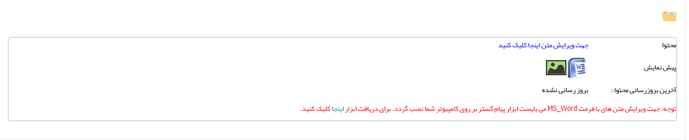

## گام2-محتوای پیام

تنظیم محتوای فکس را می توانید از قسمت[ تنظیم قالب چاپ](https://github.com/1stco/PayamGostarDocs/blob/master/help%202.5.4/Settings/Personalization-crm/Overview/General-information/Set%20the-print-template/Set%20the-print-template.md) مشاهده کنید.

