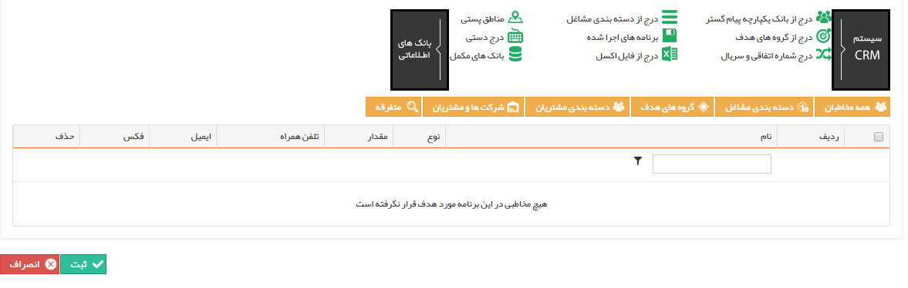

## انتخاب مخاطبان

> مسیر دسترسی:  **تبلیغات** >**فکس** > **مدیریت ارسال گروهی فکس** > **ارسال گروهی جدید** > **مدیریت مخاطبان ارسال فکس** 

برای اطلاعات بیشتر به لینک[ انتخاب مخاطبان](https://github.com/1stco/PayamGostarDocs/blob/master/help%202.5.4/Marketing/moshtarak-abzar/gam%20se/select-Audience.md) در برنامه پیام کوتاه مراجعه نمایید.

این مخاطبان باید شامل پروفایل هایی باشند که شماره فکس در آن ها وجود داشته باشد .

