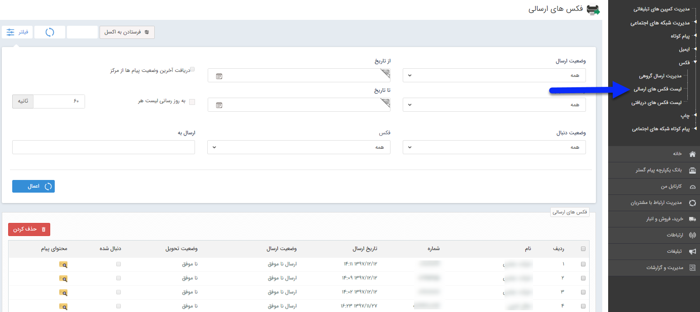

## لیست فکس های ارسالی 

در این صفحه می توانید لیست تمام فکس های ارسالی خود را مشاهده کنید . تاریخ ارسال، وضعیت ارسال و تحویل و ... فاکتورهایی هستند که می توانید بر اساس آن ها لیست فکس را محدود نمایید. همچنین محتوای فکس ارسال شده را می توانید با از ستون محتوای پیام استفاده کنید .

> نکته: برای اطلاعات بیشتر در خصوص لیست ارسال ها به قسمت <a href="C%3A%2FUsers%2FH.abasi%2FDesktop%2Fhelp%2Fmd%20help%2F%D8%AA%D8%A8%D9%84%DB%8C%D8%BA%D8%A7%D8%AA%2Fmoshtarak-abzar%2Fmoshtarak-abzar.md" target="_blank">اطلاعات مشترک لیست ارسال</a> پیام مراجعه کنید.

