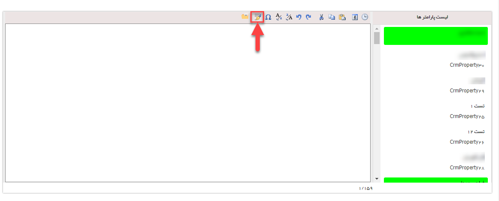
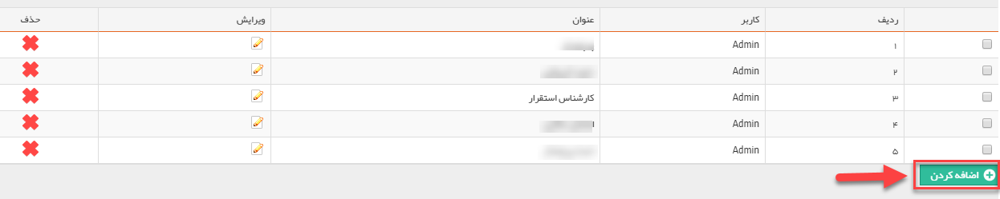
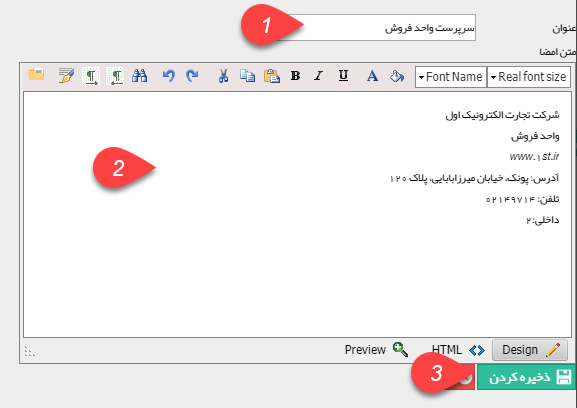

## اضافه کردن امضا

می توانید امضای خود را در نرم افزار تعریف کنید تا در انتهای هر پیام بتوانید از آن استفاده کنید.

> نکته: هر امضا تنها برای کاربری که آن را تعریف کرده است قابل نمایش است.

با دوبار کلیک بر روی هر امضا، متن آن به پیام اضافه می شود.

با استفاده از این گزینه می توانید یک امضای جدید را اضافه کنید.

در این قسمت ابتدا عنوان امضا را انتخاب کرده و سپس متن امضا را می نویسید و در نهایت جهت ثبت در سیستم، دکمه ذخیره کردن را کلیک می نمایید.

