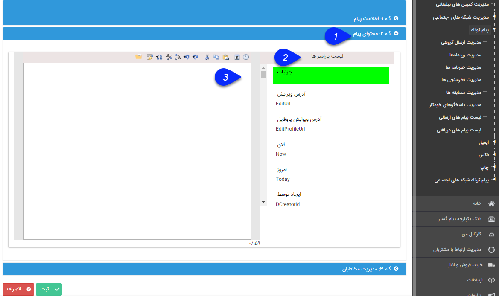

## گام دوم

در این گام محتوای پیام خود را می توانید تعیین کنید. این محتوا بستگی به رسانه مورد نظر دارد.

> نکته: می توانید از قالب های ذخیره شده در مدیریت قالب های پیام یک پیام را انتخاب کنید و ارسال نمایید. (به<a href="ghaleb-payam%2Fghaleb-payam.md" target="_blank"> انتخاب قالب پیام مراجعه کنید</a>.)

> نکته: می توانید امضای خود را در نرم افزار ذخیره کنید تا بتوانید آن را به انتهای پیام اضافه کنی<a href="add-a-signature%2Fadd-a-sign.md" target="_blank">د. (به اضافه کردن امضا مراجعه کنید</a>.)

1.محتوای پیامک : متن پیام برای ارسال به مخاطب از نوع متن ساده می باشد .

در این نوع ارسال می توانید از متن هوشمند  استفاده کنید.

> نکته: عدد زیر صفحه ارسال پیام، تعداد کاراکترهای موجود و تعداد پیام های پیامک را نشان می دهد.

2. لیست پارامترها: در این منو شما میتوانید از فیلدهای در دسترس، بعنوان کلمه متغیر (<a href="file%3A%2F%2F%2FC%3A%5CUsers%5CH.abasi%5CDesktop%5Chelp%5Cmd%20help%5C%D8%AA%D8%A8%D9%84%DB%8C%D8%BA%D8%A7%D8%AA%5Cmatn-hoshmand%5Cmatn-hoshmand.md" target="_blank">متن هوشمند</a>) استفاده نمایید.

محتوای ایمیل (رایانامه) : نوع پیام قابل استفاده از نوع  HTML

در این نوع از محتوا علاوه بر متن هوشمند می توانید از عکس و یا لینک های ویژه Hyperlink نیز استفاده کنید.

برای اضافه کردن تصویر به ایمیل ارسالی به قسمت طریقه ایجاد ایمیل عکس دار مراجعه کنید .

1. با استفاده از این گزینه می توانید یک لینک به ایمیل خود اضافه کنید(مانند HTTP://PAYAMGOSTAR.COM)

2. با راست کلیک بر روی یک لینک می توانید آن را به صورت ویژه تعیین کنید. در گزارشات مربوط به این ارسال تعداد مخاطبانی که بر روی این لینک کلیک کرده اند را نیز می توان مشاهده کرد.

3. با استفاده از این گزینه هم می شود لینک ویژه ایجاد کرد و یا لینک ایجاد شده را به لینک ویژه تبدیل کرد.

برنامه  فکس و پرینت : نوع پیام، متن Word

نحوه ویرایش یک پیام برای فکس و پرینت را همانند تنظیم قالب چاپ میتوانید انجام دهید.

2. می توان  فایل مورد نظر خود را انتخاب و یا از قالب های از پیش تعریف شده (با دو بار کلیک روی قالب مورد نظر )  برای   ارسال استفاده کنید .

 3. می توانید قالب مورد نظر برای ارسال را ایجاد کنید .  (نحوه ویرایش یک پیام برای فکس و پرینت را همانند  تنظیم قالب چاپ  میتوانید انجام دهید)
 
 

