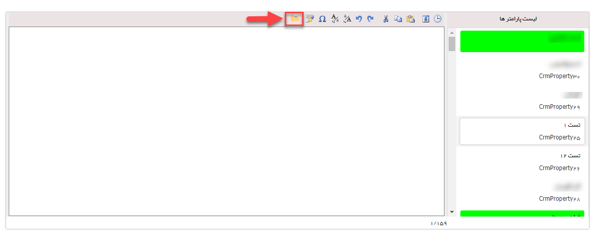
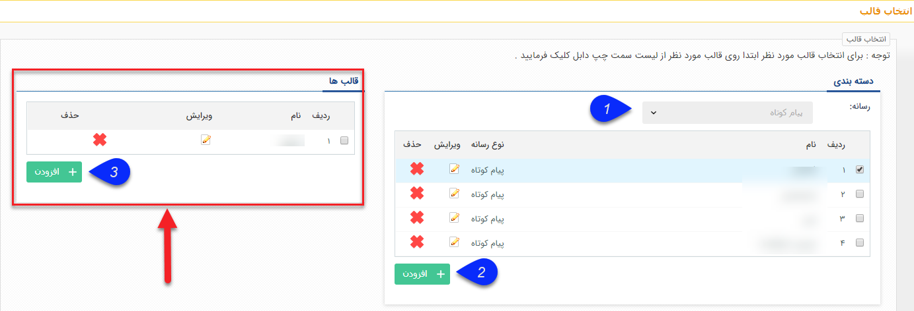
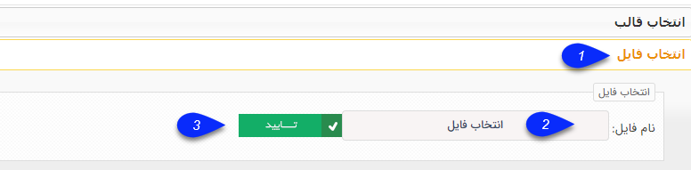

## انتخاب قالب پیام

> مسیر دسترسی:  **تبلیغات** >**پیام‌کوتاه/ایمیل/فکس/پرینت** > **برنامه‌های ارسال پیام** > **محتوای پیام** 

بسته به رسانه ای که در حال آماده کردن محتوای آن هستید می توانید از قالب پیام هایی که قبلا ذخیره شده است استفاده کنید.

ابتدا آیکون پوشه را انتخاب کنید.

سپس بر روی قالب دلخواه خود دوبار کلیک کرده تا متن آن در پیام شما درج شود.

1- از طریق فیلد رسانه می توانید، نوع رسانه، پیامک، ایمیل، فکس و چاپ  را جهت فیلتر کردن انتخاب نمایید.

2- با کلیک بر روی دکمه اضافه، نوع رسانه انتخاب و عنوان تعیین میگردد.

3- در قسمت قالب ها با کلیک بر روی اضافه کردن، با توجه به نوع رسانه قبلی، متن مورد نظر را ایجاد و یا ویرایش می نمایید.

همچنین می توانید فایل خود را به عنوان یک قالب استفاده کنید. این فایل باید با رسانه شما منطبق باشد .

فرمت فایلهای انتخابی به ترتیب عبارتند از:

1. پیامک:  فرمت Text

2.ایمیل: فرمت Html

3. فکس: فرمت مایکروسافت ورد (doc یا docx)

4. چاپ: فرمت مایکروسافت ورد (doc یا docx)

