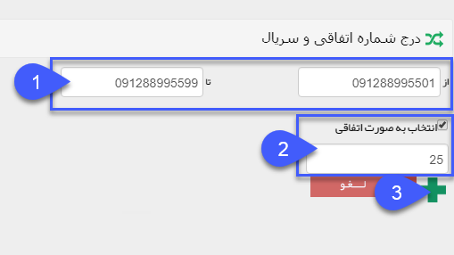

## شماره اتفاقی و سریال

1. شماره سریالی: با وارد نمودن شماره موبایل بصورت سریالی در فیلد اول(از) و شماره پایانی در قسمت (تا)  تمام شماره های مابین  به لیست ارسال شما افزوده خواهد شد.

2. شماره اتفاقی: جهت انتخاب شماره های ارسالی، از توالی شماره های انتخاب شده می  توان تیک " انتخاب بصورت اتفاقی" را زده و سپس تعداد شماره های ارسالی را انتخاب نمود.

3. در نهایت، پس از انتخاب شماره ها، با زدن این دکمه، شماره ها به لیست شما افزوده خواهند شد.

