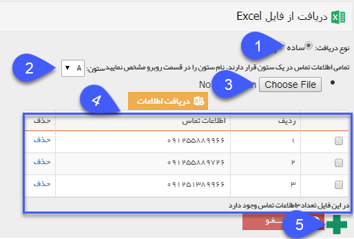
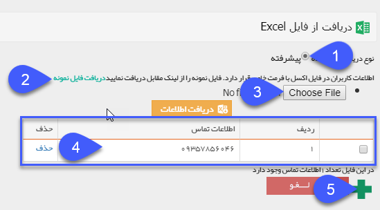

## فایل اکسل ساده-پیشرفته

می توان مخاطبان برنامه را در قالب فایل اکسل وارد نمود. به دو صورت می توان فایل اکسل را تهیه کرد .

1. فایل اکسل ساده: در این حالت، فایل تنها فایل اکسلی که شامل یک ستون شماره های موبایل می باشد وارد می گردد.

2. ستون اکسل: ستون شماره هایی که در اکسل دارید را در این فیلد انتخاب نمایید .

3. انتخاب اکسل: فایل اکسل را در این قسمت باید بارگزاری نمایید .

4. دریافت اطلاعات: پس از ثبت فایل اکسل، با زدن دکمه دریافت اطلاعات، لیست شماره ها  از اکسل، در این قسمت نمایش داده می شود.

5. در انتها، با زدن دکمه بعلاوه، لیست نمایش داده در جدول به لیست ارسال افزوده خواهد شد.

> نکته: دراین حالت نمیتوانید از متن هوشمند استفاده کنید و برای استفاده از متن هوشمند می توان از اکسل پیشرفته استفاده کرد.

فایل اکسل پیشرفته: که شامل پارامترهای هوشمندی است که در تنظیم متن به کار برده شده است.

 1. ابتدا فایل Excel  خود را تهیه نمایید. سپس از قسمت مسیر فایل Excel آن را انتخاب کنید. برای تهیه فایل اکسل می توانید از فایل نمونه استفاده نمایید. نکته مهم در تهیه فایل نمونه، عنوان ستون هاست که باید دقیقا مطابق با فایل نمونه باشد. همچنین نیازی به تکمیل کل ستون ها نیست و فقط می توانید ستون های موردنظر خود را تکمیل و سایر ستون های اضافه را پر نکنید.
 
 
 
 
 
 
 
 
 
 
 
 
 
 
 
 
 
 
 
 
 
 
 
 
