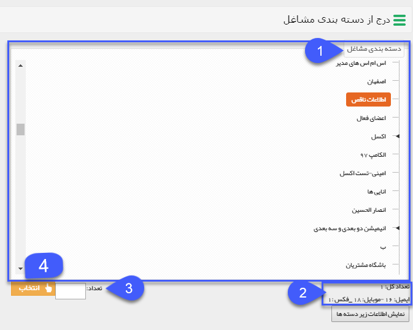

## دسته بندی مشاغل

شامل دسته بندی های بانک اطلاعاتی  می باشد که به صورت کلی می توانند به عنوان مخاطب انتخاب شوند.

1. در این مرحله تنها می توانید دسته بندی های سطح آخر را انتخاب نمایید.

2.  با انتخاب یک دسته بندی تعداد رسانه موجود در آن را در پایین صفحه نمایش می دهد .

3. می توانید تعداد موردنظر خود را در کادر تعداد وارد نمایید تا به صورت تصادفی به تعدادی از مخاطبان ارسال شود و در نهایت با زدن دکمه انتخاب، مخاطبان به لیست ارسال افزوده خواهند شد.

(به طور مثال شما از ابزار پیام کوتاه استفاده می نمایید. تعداد موبایل موجود در دسته بندی انتخابی 209 است. تعدادی که شما در کادر وارد می نمایید می تواند 209 و یا کمتر باشد.)

4.با گزینه انتخاب دسته بندی انتخاب شده به لیست ارسال اضافه خواهد شد .

