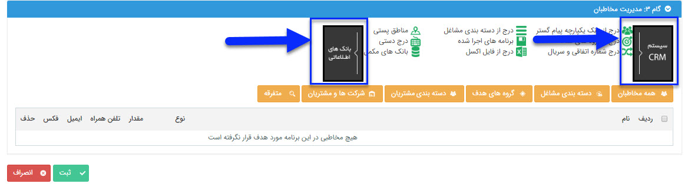

## انتخاب مخاطبان

با توجه به گزینه های مطرح شده در کادر بالای این گام که به دو دسته بانک های اطلاعاتی و سیستم CRM تقسیم شده است، با کلیک بر روی هر کدام از این دو کادر زیرشاخه های آن ها نمایش داده می شود و می توانید مخاطبان برنامه تبلیغاتی خود را به راحتی انتخاب نمایید.  

  بانک اطلاعاتی : بطور کامل جلوتر توضیح داده شده است .

 

سیستم crm :   با زدن دکمه سیستم CRM می توانید مخاطبان مرتبط با آیتم های مختلف نرم افزار (فاکتورها، فرصت ها و ...) را از منوهای این دسته بندی انتخاب کنید.

با استفاده از این قابلیت می توان هویت هایی که به آیتم های مختلف مرتبط شدن  را بعنوان مخاطب برنامه انتخاب نمود و همچنین امکان اعمال فیلتر ها برای انتخاب دقیق تر مخاطب ها وجود دارد

برای مثال می شود مخاطب هایی که برای آن ها فاکتور فروش صادر شده است  انتخاب کرد و یا هویت هایی که در یک تاریخ مشخص یک نوع فرم خاص براشون ایجاد شده فیلتر و بعنوان مخاطب برنامه انتخاب کرد .

 
 
 