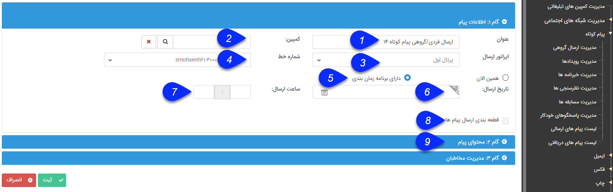

## گام اول

> مسیر دسترسی:  **تبلیغات** >**پیام‌کوتاه/ایمیل/فکس/پرینت** 

در این گام باید اطلاعات مربوط به برنامه مورد نظر ، همچنین خط مورد استفاده و  زمان اجرای برنامه  را تعیین کنید.

1. عنوان: عنوان ارسال را می توانید به دلخواه تغییر دهید.

2. کمپین: می توانید این ارسال گروهی را به یکی از کمپین های تبلیغاتی خود مرتبط کنید. تا هزینه های این ارسال و اطلاعات آن در گزارش آن کمپین تبلیغاتی محاسبه گردد.

3. اپراتور ارسال: می توانید منبع ارسال را انتخاب نمایید (پرتال اول، GSM، URL و ...)

> نکته: در صورتی که اپراتور ارسال را پرتال اولانتخاب نموده اید، باید دارای یک حساب کاربری درفهرست اول ( www. 1st.ir ) باشید و خط پیامکی را خریداری نمایید حساب کاربری خود را شارژ نمایید.  جهت دریافت راهنمایی در خصوص تهیه شارژ به تهیه شارژ اولیه از پرتال اول مراجعه کنید

4. شماره خط: از بین خطوط اپراتور انتخاب شده می توانید خط دلخواه را انتخاب نمایید.

5. زمان ارسال: می توانید تعیین کنید که ارسال اکنون انجام شود و یا بصورت زمانبندی ارسال صورت گیرد.

6. تاریخ ارسال: در صورت انتخاب گزینه دارای زمانبندی، این فیلد ظاهر می شود وبه شما این  اجازه را میدهد که تاریخ ارسال را انتخاب نمایید.

7. ساعت ارسال: در صورت انتخاب گزینه دارای زمانبندی،  این فیلد ظاهر می شود و به شما این اجازه را میدهد که ساعت ارسال پیام را انتخاب نمایید.

8. قطعه بندی ارسال:  در صورتی که مخاطبان زیادی برای برنامه خود در نظر گرفته اید و نمی خواهید تمام ارسال ها در یک زمان صورت گیرد می توانید از قطعه بندی برای ارسال پیام خود استفاده نمایید. کافی است زمان بین دو ارسال را به دقیقه مشخص نمایید. و مشخص کنید به چه تعدادی در دفعات آینده ارسال گردد.به طور مثال شما 500 مخاطب برای برنامه خود در نظر گرفته اید، می توانید به صورت هر 60 دقیقه 100 پیام ارسال شود قطعه بندی کنید.

> نکته: بهتر است در ارسال ایمیل هایی با متن نسبتا حجیم و یا ارسال فکس از قطعه بندی پیام استفاده کنید. این امر بستگی به توانایی سیستمی که نرم افزار بر روی آن نصب شده، تعداد خطوط و تعداد کارشناسان شما دارد.

9. جهت تنظیم محتوای پیام روی این گزینه کلیک نمایید تا وارد مرحله بعد تنظیمات ارسال پیام گروهی شوید.

