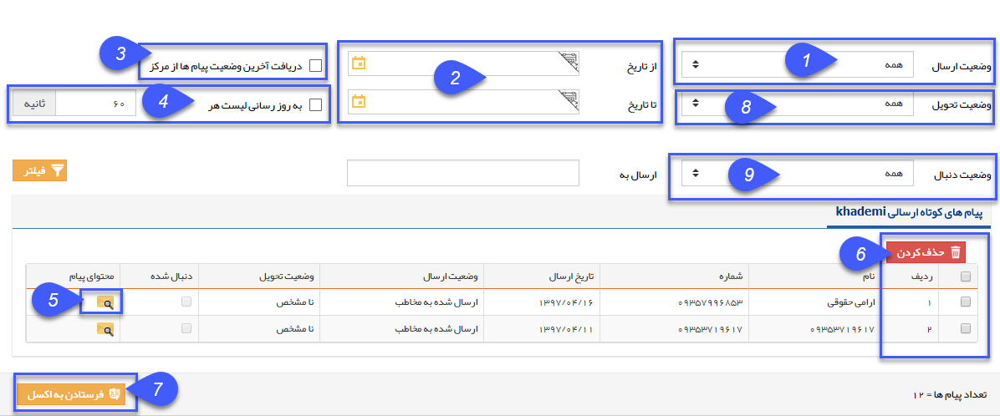
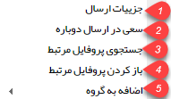

## اطلاعات مشترک بین ابزار ها

بدون در نظر گرفتن رسانه ارسال(پیام کوتاه، فکس، ایمیل)، هر برنامه تبلیغاتی شامل 3 مرحله یکسان می شود. (البته برنامه هایی مانند نظرسنجی و پاسخگو و ... دارای مراحل خاص دیگری نیز هستند.)

این 3 مرحله به ترتیب زیر می باشد.

<a href="gam%20yk%2Fgam-yk.md" target="_blank">1. گام اول - اطلاعات پیام</a>

<a href="gam%20do%2Fgam-do.md" target="_blank">2. گام دوم - محتوای پیام</a>

<a href="gam%20se%2Fselect-Audience.md" target="_blank">3. گام سوم -انتخاب مخاطبان</a>

نکته: قبل از اجرای انبوه، پیام تنظیم شده را یک بار برای خود ارسال نمایید تا بتوانید از صحت اجرای برنامه اطمینان حاصل نمایید.

پس از اجرای هر برنامه:

بعد از اجرای هر برنامه در صفحه مدیریت انواع ارسال ها در لیست برنامه ها ، می توانید برنامه ایجاد شده  را مانند تصویر مشاهده نمایید که در لیست برنامه قرار گرفته شده است. (در اینجا لیست ارسال گروهی در نظر گرفته شده است)

1. ارسال گروهی جدید: میتوانید یک ارسال گروهی جدید را آغاز کنید.

2. نام: عنوانی که برای ارسال انتخاب شده را نمایش میدهد.

3. ایجادکننده: کاربر ایجاد کننده ارسال گروهی را نمایش میدهد.

4. تاریخ شروع: تاریخ شروعی که برای ارسال در نظر گرفته شده را نمایش میدهد.

5. تاریخ پایان: تاریخ پایان ارسال را نمایش میدهد.

6.  دوره :  دوره ی اجرا  برنامه ارسال نمایش داده می شود. برای مثال  در ارسال رویداد ممکن است برنامه تنظمی شده روزانه باشد  در این صورت در این قسمت نمایش داده می شود که روزانه است .

7. وضعیت: قسمت اطلاعات مشترک لیست ارسال پیام را مطالعه کنید.

8. تحلیل نتایج: نتایج مرتبط با این ارسال را می توانید مشاهده کنید. (به<a href="file%3A%2F%2F%2FC%3A%5CUsers%5CH.abasi%5CDesktop%5Chelp%5Cmd%20help%5C%D8%AA%D8%A8%D9%84%DB%8C%D8%BA%D8%A7%D8%AA%5CAdvertising-analysis-chart%5CAdvertising-analysis-chart.md" target="_blank"> نمودارهای تحلیلی برنامه های تبلیغاتی</a> مراجعه کنید.)

9. لیست ارسال: می توانید  وضعیت ارسال برای هرکدام از مخاطبان  این برنامه را مشاهده کنید.(برنامه هایی که قابلیت دریافت دارند مثل نظرسجی،مسابقه و ... در این قسمت لیست ارسال و دریافت را دارند که با مشاهده آن می شود مشخص کرد که می خواهد لیست ارسال مربوط به این برنامه مشاهده شود یا لیست دریافت )

10. ویرایش: تنها برنامه هایی قابلیت ویرایش دارند که وضعیت آن ها تازه درج  و یا در حال اجرا می باشد.  برنامه های در حال اجرا از زمان ویراش به بعد بصورت ویرایش شده عمل می کند .

11. حذف: در صورتی که برنامه تازه درج شده  و یا در حال اجرا باشد حذف شود، ارسالی صورت نمی گیرد ولی در صورتی که وضعیت برنامه تمام شده باشد و برنامه را حذف نمایید، برنامه اجرا شده است و با حذف آن تنها نتایج برنامه را مشاهده نمی کنید.

کلیک راست:  در ارسال گروهی راست کلیک بر روی یک برنامه شامل موارد زیر می باشد :

Forward: اجرای این برنامه با مخاطبان جدید

Reply: اجرای برنامه جدید به مخاطبان این برنامه

 ایجاد برنامه وابسته : برنامه ی مرتبط با یک برنامه، برنامه ای است با تنظیمات و مخاطبان جدیدی نسبت به برنامه قبلی.

تصور کنید که گروه و یا دسته ای را به عنوان مخاطبان یک برنامه انتخاب کرده اید و به تمام اعضای گروه پیامی را ارسال کرده اید. در هفته های آینده تعداد جدیدی مخاطب به دسته بندی موردنظر افزوده شده است و شما می خواهید همان پیام به آن ها ارسال شود، به جای اجرای یک برنامه جدید می توانید برنامه مرتبط با آن برنامه را اجرا نمایید، منتها در این برنامه تنها به مخاطبانی ارسال صورت می گیرد که در برنامه قبلی حضور نداشتند. (بدون ارسال تکراری ها )

یا تصور نمایید دسته ای را به عنوان مخاطبان یک برنامه انتخاب کرده اید و تعدادی از آن ها را به صورت تصادفی انتخاب می کنید و برنامه ای اجرا می شود. درروزهای آینده می توانید برنامه مرتبطی را اجرا کنید که مخاطبان تصادفی برنامه قبل در این برنامه مرتبط وجود نداشته باشد.)

یعنی این بصورتی کار می کند که هویت هایی که قبلا ارسال شده  ارسال انجام نمیشود و به هویت هایی که در اون گروه هستن و ارسالی بهشون انجام نشده ارسال می شود .

## لیست ارسال یک برنامه تبلیغاتی

در لیست ارسال امکان مشاهده پیام های ارسالی به همراه زمان ارسال ، وضعیت ارسال و تحویل و محتوای پیام ارسال شده است .

 در برنامه های دوطرفه مانند پاسخگو، مسابقه، نظرسنجی که علاوه بر ارسال پیام، قابلیت دریافت پیام را نیز دارا هستند با تغییر لیست ارسال به لیست دریافت، امکان مشاهده پیام هایی که از سمت مشتریان و مخاطبان برای پاسخ به این برنامه ارسال شده است وجود دارد .

برای مشاهده لیست ارسال و یا لیست دریافت ، کاربر نیاز به مجوز مشاهده ليست پيام هاي ارسالي  دريافتي دارد .

1.وضعیت ارسال : انواع وضعیت ارسال ها به شرح ذیل می باشد:

A . در صف ارسال: پیام به درستی در صف ارسال قرار گرفته و در حال ارسال است.

B . ارسال شده به مرکز: پیام به درستی به پنل مرکز  ارسال شده است.

C . ارسال شده به مخاطب: مخاطب پیام را به درستی دریافت کرده است.

D . ارسال ناموفق: مخاطب پیام را دریافت نکرده است.

E . مشکوک به ارسال شده به مرکز: مشکوک به ارسال شده و یا ارسال دوباره به دلایل زیر خواهد بود.

 الف. درست نبودن نام کاربری و رمز عبور پرتال اول مورد استفاده

 ب. مسدود بودن نام کاربری پرتال اول به دلیل رمز عبور اشتباه

 پ. موجودی ناکافی (شارژ نام کاربری)

 ت. مورد تایید نبودن مدارک هویتی
 
 F. ارسال دوباره: نشان دهنده تلاش مجدد برای ارسال است که دلایل این حالت همانند وضعیت مشکوک به ارسال شده به مرکز است.

2. از تاریخ/تا تاریخ: می توانید ابتدا و انتهای بازه زمانی ارسال را مشخص کنید.

3. دریافت آخرین وضعیت پیام ها از مرکز: با فعال کردن این گزینه، کلید فیلتر علاوه بر اعمال فیلترهای تعیین شده، آخرین وضعیت ارسال و تحویل  پیام ها را از سرور دریافت خواهد کرد.

4. به روز رسانی لیست : با استفاده از این گزینه می توانید بر حسب ثانیه تعیین کنید که این لیست ارسال هر چند ثانیه یکبار به روز رسانی گردد.

5. محتوای پیام: با استفاده از این گزینه می توانید محتوای پیام ارسال شده را مشاهده کنید.

6. حذف: می توانید سابقه پیام ارسال شده را حذف کنید، کافی است پیام های مورد نظر را با تیک انتخاب و سپس دکمه حذف را کلیک نمایید.

7. فرستادن به اکسل: می توانید لیست ارسال های انتخاب شده را در قالب فایل اکسل دریافت کنید.

8. وضعیت تحویل  پیام کوتاه و فکس   : نامشخص-تحویل داده شده- ناموفق

A. نامشخص: هنوز مرکز پاسخی برای وضعیت تحویل پیامک به مخاطب  برای نرم افزار ارسال نکرده است.

B. تحویل داده شده:  پیامک به مخاطب تحویل داده شده است. (Delivery Report)

C. ناموفق: پیامک به مخاطب تحویل داده نشده است.

وضعیت تحویل ایمیل : انواع وضعیت تحویل ها به شرح ذیل می باشد.

A. نامشخص: ایمیل ارسال شده هنوز توسط مخاطب باز نشده است.

B. تحویل داده شده:  ایمیل ارسال شده توسط مخاطب حداقل یکبار باز شده است.

C. ناموفق: آدرس ایمیل مخاطب اشتباه است.

9. وضعیت دنبال پیام کوتاه و فکس : در حالتی که پیامک ارسال شده بتواند جواب داشته باشد  (مانند پیامک های نظر سنجی، مسابقه، پاسخگوی خودکار)، وضعیت های دنبال شده به شرح ذیل است:

A. دنبال شده:  مخاطب پیامی در جواب پیامک ارسال کرده است.

B. دنبال نشده: مخاطب تا کنون پیامکی در جواب پیامک ارسال نکرده است.

وضعیت دنبال ایمیل : اگر ایمیل ارسال شده دارای لینک ویژه باشد:

A. دنبال شده: مخاطب بر روی لینک ویژه موجود در ایمیل کلیک کرده است.

B. دنبال نشده: مخاطب تاکنون بر روی لینک ویژه موجود در ایمیل کلیک نکرده است .

کلیک راست بر روی یک پیام شامل موارد زیر است :

جزئیات ارسال: در این قسمت جزییات مرتبط با ارسال پیام مانند کد رهگیری و وضعیت تحویل و ارسال را می توانید مشاهده کنید.

سعی در ارسال دوباره: این پیام دوباره ارسال خواهد شد .

جستجوی پروفایل مرتبط: پروفایل هایی که در نرم افزار شامل این شماره و یا ایمیل هستند را نمایش می دهد .

باز کردن پروفایل مرتبط: در صورتی که بسته به رسانه تبلیغاتی، اطلاعات شماره و یا ایمیل موردنظر، در پیام گستر ثبت شده باشد، با انتخاب این گزینه پروفایل مربوط به این شماره و یا ایمیل بازخواهد شد .

اضافه به گروه: در صورتی که شماره و یا ایمیل مربوط به یک پروفایل در پیام گستر باشد، می توان از همین بخش آن را به گروه هدف خاصی برای پیگیری های آینده اضافه نمود .

