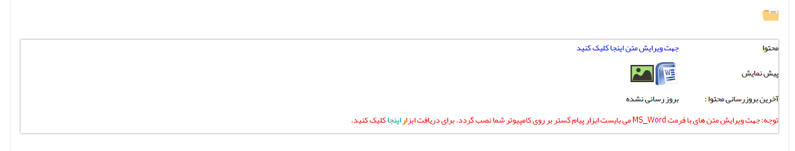

## گام2-محتوای پیام

تنظیم محتوای چاپ را می توانید از قسمت [تنظیم قالب چاپ](https://github.com/1stco/PayamGostarDocs/blob/master/help%202.5.4/Settings/Personalization-crm/Overview/General-information/Set%20the-print-template/Set%20the-print-template.md)   مشاهده کنید.

> نکته : در هنگام استفاده از چاپ چندتایی، در مرحله تنظیم متن ( جهت ویرایش متن اینجا کلیک کنید) باید صفحه word  خود را به اندازه ای کوچک نمایید که به اندازه یک قسمت از تقسیم بندی باشد که هنگام تعریف پرینتر مشخص کردیم باشد .

