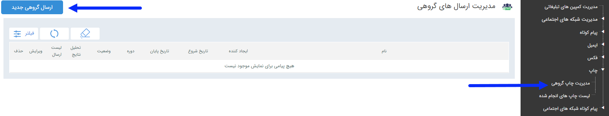

## مدیریت ارسال گروهی

با استفاده از این قابلیت امکان چاپ بصورت گروهی برای مخاطبان فراهم می گردد .

چاپ به دو صورت امکان پذیر است. چاپ صفحه ای و چاپ چندتایی در یک صفحه.

نکته: برای تنظیمات چاپ به قسمت پرینتر در تنظیمات کلی  مراجعه کنید.

از چاپ چندتایی در یک صفحه، برای مواردی مانند چاپ lable استفاده می شود.

> نکته : چاپ چندتایی مستقیم به پرینتر فرستاده نمی شود و در فولدری مورد نظری که در قسمت مسیر خروجی  وارد نموده اید به صورت فایل قرار می گیرد و این فایل ها را می توانید به پرینتر ارسال نمایید.

گام1-اطلاعات اولیه چاپ گروهی

گام2-تنظیم متن

گام3-انتخاب مخاطبان

