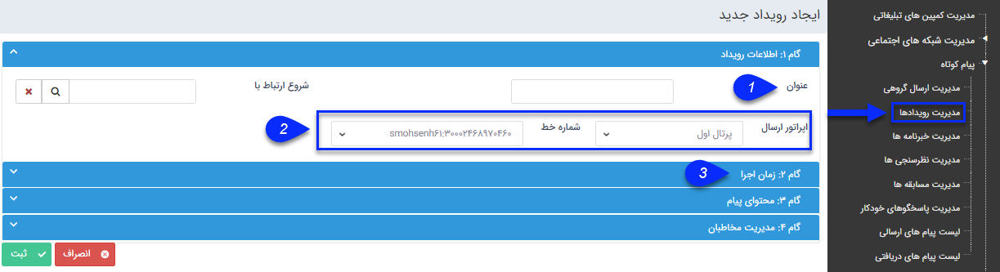

## گام1-اطلاعات اولیه رویداد

 به گام اول - اطلاعات پیام در<a href="file%3A%2F%2F%2FC%3A%5CUsers%5CH.abasi%5CDesktop%5Chelp%5Cmd%20help%5C%D8%AA%D8%A8%D9%84%DB%8C%D8%BA%D8%A7%D8%AA%5Cmoshtarak-abzar%5Cmoshtarak-abzar.md" target="_blank"> اطلاعات مشترک ابزارها</a> مراجعه کنید.

 1- دراین فیلد عنوان رویداد مشخص می شود
 2- اپراتور ارسال و رسانه ارسال از طریق این دو فیلد مشخص می شود
 3- جهت ادامه، باید به مرحله دوم - زمان اجرا بروید
 
 