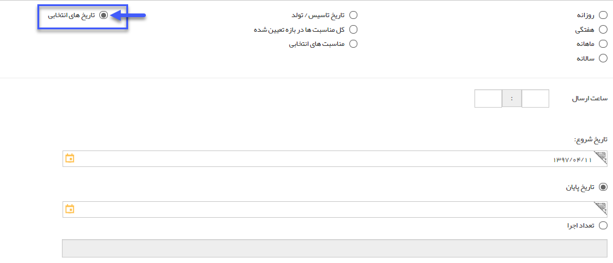

## گام2-زمان بندی اجرا

در این گام، سه نوع زمان بندی برای اجرای برنامه پیشنهاد می شود :

1. زمان بندی دوره ای - به صورت انتخابی از شکل های روزانه، هفتگی، ماهانه و سالانه تعیین شده و بر اساس کادر بازه اجرا می توان به دو صورت این بازه را تعیین کرد :

یا شروع و پایان مورد نظر را تعیین کرد، و یا تاریخ شروع و تعداد دفعات اجرا را معلوم نمود.

2. انتخاب کرد ، یا زمانی که گزینه کل مناسبت ها در این بازه انتخاب می شود تمامی مناسب های تعریف شده در مدیریت اعیاد و مناسب ها از تاریخ امروز به بعد نمایش داده می شود و در مناسبت هایی که بین بازه تاریخی شروع و پایان است پیام تنظیم شده برای مخاطب ارسال خواهد شد و همچنین این امکان وجود دارد که مناسب های مورد نظر انتخاب شود برای ارسال پیام و برای هر مناسبت در گام بعدی پیام مرتبط تنظیم شود .

> نکته : اگر در [مدیریت اعیاد و مناسبت ها](https://github.com/1stco/PayamGostarDocs/blob/master/help%202.5.4/Basic-Information/Holiday-management-and-occasions/Holiday-management-and-occasions.md) برای مناسب های تعریف شده پیامی تنظیم شده باشد ، زمانی که تاریخ مورد نظر انتخاب شود برای ارسال رویداد ، متن پیام تعریف شده نمایش داده خواهد شد که می توان آن را ویرایش کرد .

می توان تاریخ شروع و تاریخ پایان بازه اجرا را تعیین کرد.

 

3. زمان بندی پیشرفته - با انتخاب این گزینه، در گام بعد  می توان یک و یا چند تاریخ از روی تقویم  (تاریخ اعیاد و مناسبت ها و یا تاریخ های مورد نظر ) انتخاب کرد  و سپس برای هر کدام از تاریخ های مورد نظر، متن مناسب نوشته می شود .

می توان تاریخ شروع و تاریخ پایان بازه اجرا را تعیین کرد.

تعداد اجرا: این فیلد به شما امکان تعریف تعداد تکرار در اجرای این برنامه را در تاریخ های تعیین شده می دهد.

