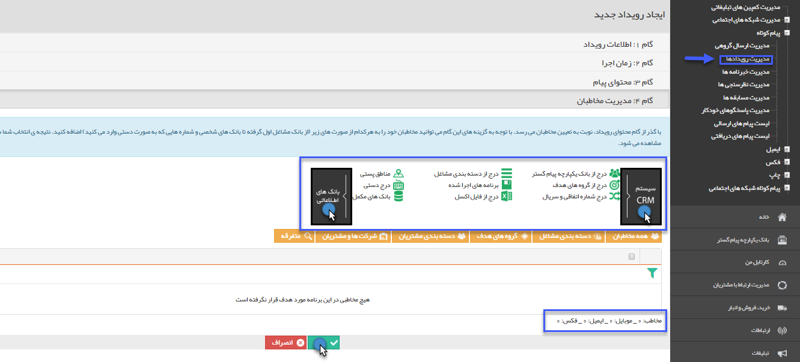

## گام4-انتخاب مخاطب

> مسیر دسترسی:  **تبلیغات** >**پیام‌کوتاه** > **مدیریت رویدادها** > **ارسال رویداد جدید** > **انتخاب مخاطبان رویداد** 

برای استفاده از این بخش به لینک ([ انتخاب مخاطبان](https://github.com/1stco/PayamGostarDocs/blob/master/help%202.5.4/Marketing/moshtarak-abzar/gam%20se/select-Audience.md) ) مراجعه نمایید.

این مخاطبان باید شامل پروفایل هایی باشند که شماره تلفن همراه در آن ها وجود داشته باشد .

