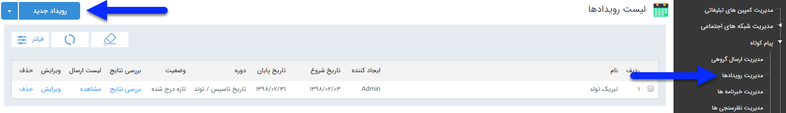

## رویداد تبلیغاتی

برای ارسال پیام هوشمند در زمانبندهای دقیق و پیشرفته، می توانید از رویداد تبلیغاتی استفاده کنید.

با استفاده از رویداد می توان زمانبندی های مشخصی برای ارسال پیام های متفاوت در نظر گرفت ، برای مثال می توان برای تاریخ هایی که در مدیریت اعیاد و مناسبت ها تعریف شده است پیام های متفاوتی تنظیم کرد تا در همان تاریخ ها برای مخاطبان انتخاب شده ،  ارسال شود .

 در صفحه اول، می توان با تعیین تاریخ اجرا ، ایجاد کننده رویداد و یا عنوان تعریف شده برای رویداد و زدن دکمه فیلتر، لیست برنامه های اجرا شده در گذشته را مشاهده کرد. اما برای اجرای یک برنامه جدید باید بر روی دکمه " رویداد جدید " در سمت راست و بالای صفحه کلیک کرده و با گذراندن چند گام ساده، برنامه را به راحتی اجرا کرد
 
<a href="1-avalie%2Favalie-roydad.md" target="_blank"> گام 1- اطلاعات رویداد</a> 

<a href="2-zaman-bandi%2Fzaman-bandi.md" target="_blank">گام 2- زمان اجرا</a> 

 <a href="3-tanzim-matn%2Ftanzim-matn.md" target="_blank">گام3- محتوای پیام</a>

<a href="4-entekhab-mokhatab%2Fentekhab-mokhatab.md" target="_blank">گام4- مدیریت مخاطبان</a>

 