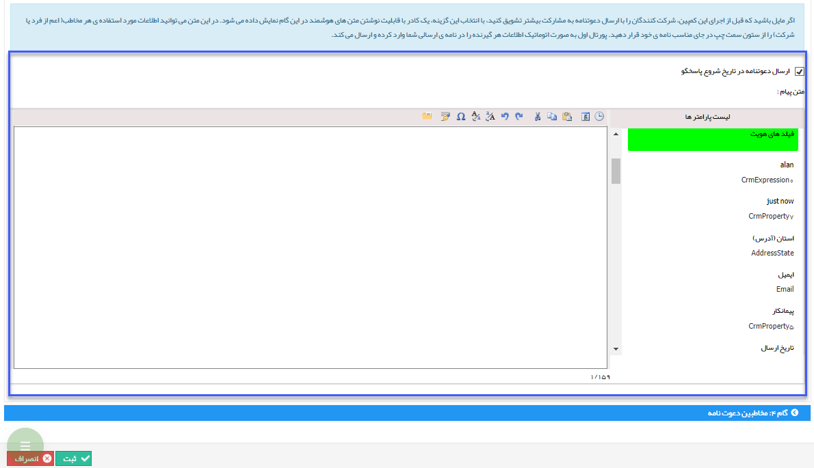

## گام3-دعوتنامه

در این گام در صورت نیاز می توانید برای آغاز به کار پاسخگوی خودکار دعوتنامه تعیین و به مخاطبان دلخواه ارسال کنید تا از امکانات آن مطلع گردند.

در بالای کادر متن هوشمند ، تیک ارسال دعوتنامه را فعال کنید تا امکان استفاده از متن هوشمند (به عنوان یکی از ویژگی های خاص پیام گستر) در این گام برای شما فراهم شود. با فعال شدن متن، به طور پیش فرض عنوان و محتوای پاسخگو نمایان می شود که قابل ویرایش است.

