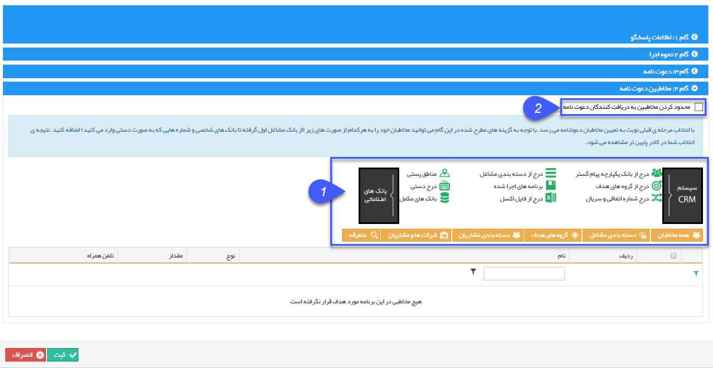

## انتخاب مخاطبان دعوتنامه

1. انتخاب مخاطبین:

اگر در گام قبل تصمیم به ارسال دعوتنامه گرفته باشید، در این گام باید [مخاطبان دعوتنامه](https://github.com/1stco/PayamGostarDocs/blob/master/help%202.5.4/Marketing/moshtarak-abzar/gam%20se/select-Audience.md) را تعیین کنید.

برای اطلاعات بیشتر به قسمت انتخاب مخاطبان ارسال گروهی پیام کوتاه مراجعه نمایید.

این مخاطبان باید شامل پروفایل هایی باشند که شماره تلفن همراه در آن ها وجود داشته باشد .

2. محدود نمودن مخاطبان: در این قسمت با زدن تیک، مخاطبان پاسخگوی خودکار فقط افرادی هستند که در این دعوتنامه برایشان پیام می فرستید و

مخاطبان دیگر نمی توانند از پاسخگوی خودکار استفاده کنند .

