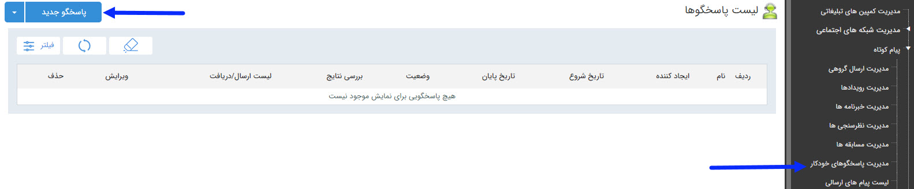

## پاسخگو خودکار

برای ارسال خودکار اطلاعات به مخاطب مانند آدرس، شماره فکس و .... می توانید از این آیتم تبلیغات استفاده کنید.

این قابلیت به این صورت می باشد که باید گزینه و اطلاعات مورد نظر برای ارسال تعریف می شود و مخاطب با ارسال هر کدام از گزینه های مورد نظر اطلاعات مربوط به آن گزینه را دریافت می کند . 

در صفحه اول، می توان با تعیین تاریخ اجرا و زدن دکمه فیلتر، لیست برنامه های اجرا شده در گذشته را مشاهده کرد. اما برای اجرای یک برنامه جدید باید بر روی دکمه "پاسخگوی جدید" در سمت راست و بالای صفحه کلیک کرده و با گذراندن چند گام ساده، برنامه را به راحتی اجرا کرد .

لطفا ابتدا<a href="C%3A%2FUsers%2FH.abasi%2FDesktop%2Fhelp%2Fmd%20help%2F%D8%AA%D8%A8%D9%84%DB%8C%D8%BA%D8%A7%D8%AA%2Fmoshtarak-abzar%2Fmoshtarak-abzar.md" target="_blank">  اطلاعات مشترک ابزارها </a>را مطالعه فرمایید و طبق گام های زیر برای ارسال گروهی جدید اقدام فرمایید.

<a href="1-avalie-khodkar%2F1-avalie-khodkar.md" target="_blank">گام1-اطلاعات پاسخگو</a>

<a href="2-nahveejra-khodkar%2F2-nahveejra-pasokh-khodkar.md" target="_blank">گام2- نحوه اجرا</a> 

<a href="3-davatname-pasokh-khodkar%2F3-davatname-pasokh-khodkar.md" target="_blank">گام3- دعوتنامه</a>  

<a href="4-mokhatab-pasokh-khodkar%2F4-mokhatab-pasokh-khodkar.md" target="_blank">گام4- مخاطبین دعوتنامه</a>

