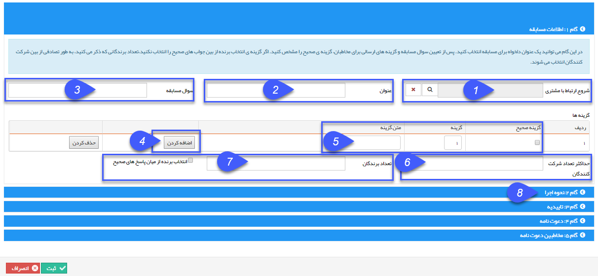

## گام1-اطلاعات اولیه مسابقه

> مسیر دسترسی:  **تبلیغات** >**پیام‌کوتاه** > **مدیریت مسابقه‌ها** > **مسابقه جدید** > **اطلاعات مسابقه** 

1. شروع ارتباط با مشتری: در صورت تمایل، می توان کمپین تبلیغاتی مشخصی را به این نظرسنجی متصل کرد تا تعداد پیام های ارسالی در هزینه های آن کمپین محاسبه گردد.

2. تعیین یک عنوان: یک عنوان برای مسابقه انتخاب کنید.

3. تعیین سوال مسابقه: سوال مسابقه در این فیلد باید مشخص شود.

4. اضافه کردن : ابتدا جهت تعریف گزینه ها، دکمه اضافه کردن را بفشارید تا امکان ایجاد گزینه ها فراهم شود و همچنن : در هر مرحله بازدن دکمه اضافه کردن، یک گزینه دیگر می توانید تعریف نمایید.

5. گزینه ها: در این قسمت، شماره گزینه ها را باید تعیین کنید، دقت شود که مخاطبان از شماره گزینه ها بعنوان متن ارسالی جهت شرکت در نظرسنجی استفاده خواهند کرد و همچنین متن گزینه ها باید تعریف شود .

 6. حداکثر تعداد شرکت کنندگان : : با استفاده از این گزینه امکان محدود کردن تعداد مخاطبان وجود دارد

 7. تعداد برندگان: در این قسمت، می توانید تعداد برندگان از بین شرکت کنندگان را تعیین کنید و حتی تعیین کنید که برندگان از بین پاسخ های صحیح انتخاب شود .

8. با زدن گام 2 به مرحله بعد خواهید رفت.

