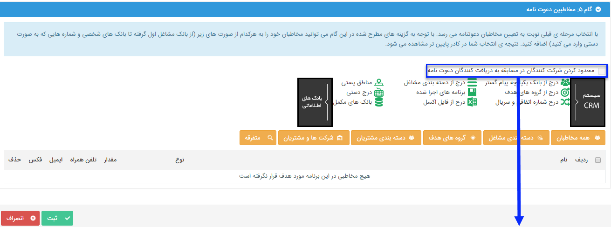

## گام5-انتخاب مخاطبان برنامه

اگر در گام قبل تصمیم به ارسال دعوتنامه گرفته باشید، در این گام باید مخاطبان دعوتنامه را تعیین کنید .

برای اطلاعات بیشتر به قسمت <a href="file%3A%2F%2F%2FC%3A%5CUsers%5CH.abasi%5CDesktop%5Chelp%5Cmd%20help%5C%D8%AA%D8%A8%D9%84%DB%8C%D8%BA%D8%A7%D8%AA%5Cmoshtarak-abzar%5Cgam%20se%5Cselect-Audience.md" target="_blank">انتخاب مخاطبان </a>ارسال گروهی پیام کوتاه مراجعه نمایید.

این مخاطبان باید شامل پروفایل هایی باشند که شماره تلفن همراه در آن ها وجود داشته باشد

با فعال کردن این گزینه فقط مخاطبانی که دعوت نامه را دریافت می کنند می توانند در مسابقه شرکت کنند.

