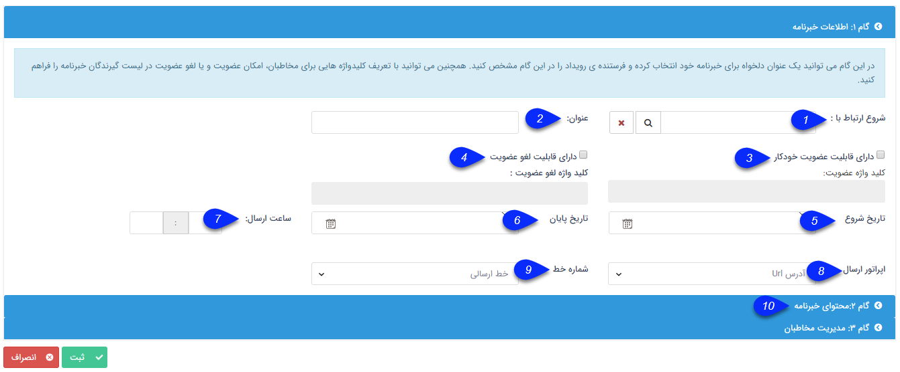

## گام1-اطلاعات اولیه خبر نامه 

1. شروع ارتباط با مشتریان: در صورت تمایل، می توان کمپین تبلیغاتی مشخصی را به این خبرنامه متصل کرد تا تعداد پیام های ارسالی در هزینه های آن کمپین محاسبه گردد.

2. عنوان خبرنامه: عنوان خبرنامه در این فیلد مشخص می شود.

3و4. دارای قابلیت عضویت و لغو عضویت: می توانید کد های عضویت و لغو عضویت تعریف کنید تا مخاطبان با ارسال این کدها، به ترتیب عضویت و لغو عضویت خود را نسبت به خبرنامه اعمال کنند.

5. تاریخ شروع: تاریخ شروع ارسال خبرنامه را تعیین کنید.

6. تاریخ پایان: تاریخ پایان ارسال روزانه خبرنامه ها را تعیین کنید.

7. ساعت ارسال: ساعت ارسال پیام را در این فیلد مشخص نمایید.

8. اپراتور ارسال: اپراتور ارسال پیام خبرنامه را در این فیلد باید انتخاب نمایید.

9. شماره خط: پس از انتخاب اپراتور ارسال، خطی که مایلین از آن خبرنامه ارسال شود مشخص کنید.

> نکته: در صورتی که امکان عضویت در خبرنامه فعال باشد، باید خط مورد نظر در دسترس باشد، یعنی برنامه دیگری (مسابقه، نظر سنجی و ...) بر روی آن خط در بازه اجرای این برنامه فعال نباشد.

10. جهت رفتن به مرحله بعد، روی گام 2 کلیک نمایید.