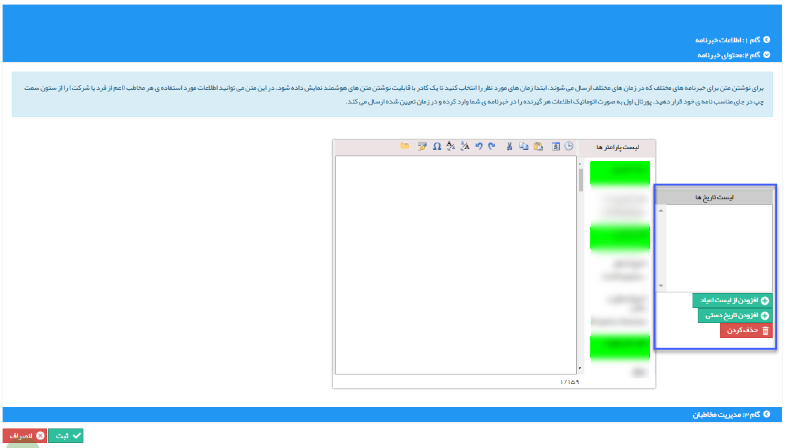

## گام2-تنظیم متن

در این گام می توانید متن مورد نظر برای ارسال را وارد کنید. ابتدا از روی تقویم و یا  لیست مناسبت ها ، یک و یا چند تاریخ را مشخص کنید.

لطفا به قسمت<a href="file%3A%2F%2F%2FC%3A%5CUsers%5CH.abasi%5CDesktop%5Chelp%5Cmd%20help%5C%D8%AA%D8%A8%D9%84%DB%8C%D8%BA%D8%A7%D8%AA%5Cmoshtarak-abzar%5Cgam%20do%5Cgam-do.md" target="_blank">  گام دوم - محتوای پیام </a> در<a href="C%3A%2FUsers%2FH.abasi%2FDesktop%2Fhelp%2Fmd%20help%2F%D8%AA%D8%A8%D9%84%DB%8C%D8%BA%D8%A7%D8%AA%2Fmoshtarak-abzar%2Fmoshtarak-abzar.md" target="_blank"> اطلاعات مشترک ابزارها  </a>مراجعه کنید.

برای اطلاع در خصوص انتخاب تاریخ ها <a href="file%3A%2F%2F%2FC%3A%5CUsers%5CH.abasi%5CDesktop%5Chelp%5Cmd%20help%5C%D8%AA%D8%A8%D9%84%DB%8C%D8%BA%D8%A7%D8%AA%5Csms%5CAdvertising-event%5C3-tanzim-matn%5Ctanzim-matn.md" target="_blank">به گام 3- تنظیم متن </a>رویداد تبلیغاتی مراجعه کنید.

در ابتدا تاریخ پیام ها و سپس متن پیام را می نویسیم و در نهایت با کلیک بر روی دکمه گام سوم وارد مرحله نهایی می شویم.

