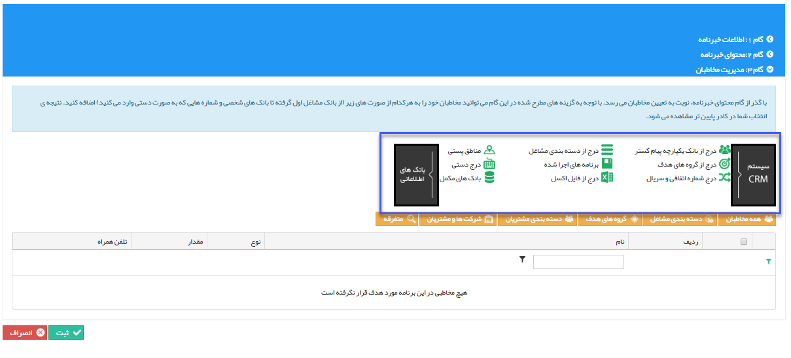

## گام3-انتخاب مخاطبان

در قسمت<a href="C%3A%2FUsers%2FH.abasi%2FDesktop%2Fhelp%2Fmd%20help%2F%D8%AA%D8%A8%D9%84%DB%8C%D8%BA%D8%A7%D8%AA%2Fmoshtarak-abzar%2Fgam%20se%2Fselect-Audience.md" target="_blank">  انتخاب مخاطب</a>ان ارسال گروهی پیام کوتاه توضیح داده شده است.

این مخاطبان باید شامل پروفایل هایی باشند که شماره تلفن همراه در آن ها وجود داشته باشد .

در این مرحله پس از انتخاب مخاطبان از بانک های اطلاعاتی، یک لیست از مخاطبان هدف ساخته می شود که با زدن دکمه ثبت، خبرنامه ایجاد و برنامه ی آن شروع به کار میکند.

>   نکته:  با زدن دکمه سیستم CRM میتوانید مخاطبان هدف خود را از هویت هایی که قبلا برای آن ها آیتم crm ثبت شده است انتخاب کنید .

