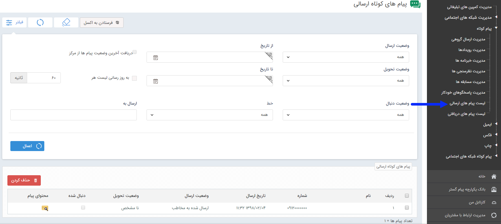

## لیست پیام های ارسالی

می توان تمام پیام هایی که در قالب برنامه های مختلف به مخاطبان ارسال شده یا در حال ارسال است مشاهده نمود. می توان نمایش این پیام ها را بر اساس پارامترهای مختلفی از قبیل خطی که برای ارسال پیام استفاده شده است یا تاریخ ارسال یا وضعیت پیام محدود نمود. همچنین می توان وضعیت ارسال، تحویل پیام ها را مشاهده نمود. در صورتی که برنامه ای که اجرا نموده اید نظرسنجی، مسابقه و یا پاسخگو باشد اگر پیامی به شما ارسال شده باشد در قسمت دنبال شده می توانید آن را مشاهده نمایید.

نکته: برای اطلاعات بیشتر در خصوص لیست ارسال ها به قسمت<a href="file%3A%2F%2F%2FC%3A%5CUsers%5CH.abasi%5CDesktop%5Chelp%5Cmd%20help%5C%D8%AA%D8%A8%D9%84%DB%8C%D8%BA%D8%A7%D8%AA%5Cmoshtarak-abzar%5Cmoshtarak-abzar.md" target="_blank"> اطلاعات مشترک لیست ارسال</a> پیام مراجعه کنید.

