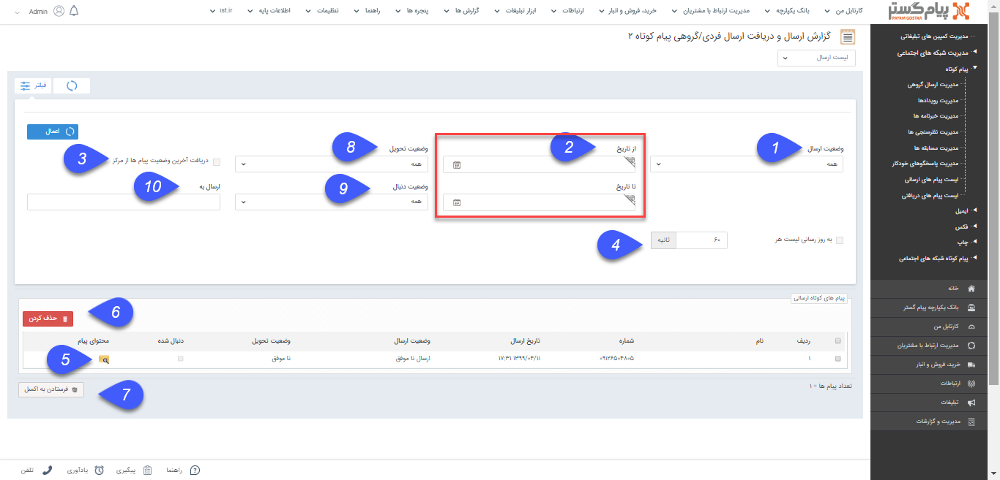
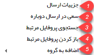
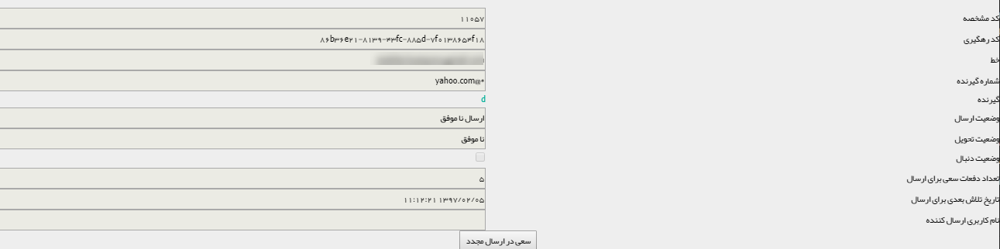

## لیست ارسال یک برنامه تبلیغاتی:

> مسیر دسترسی:  **تبلیغات** >**پیام‌کوتاه/ایمیل/فکس/پرینت** > **لیست ارسال** 

در لیست ارسال امکان مشاهده پیام های ارسالی به همراه زمان ارسال ، وضعیت ارسال و تحویل و محتوای پیام ارسال شده است .

 در برنامه های دوطرفه مانند پاسخگو، مسابقه، نظرسنجی که علاوه بر ارسال پیام، قابلیت دریافت پیام را نیز دارا هستند با تغییر لیست ارسال به لیست دریافت، امکان مشاهده پیام هایی که از سمت مشتریان و مخاطبان برای پاسخ به این برنامه ارسال شده است وجود دارد .

برای مشاهده لیست ارسال و یا لیست دریافت ، کاربر نیاز به مجوز مشاهده ليست پيام هاي ارسالي  دريافتي دارد .

1. **وضعیت ارسال:**  انواع وضعیت ارسال ها به شرح ذیل می باشد

A . در صف ارسال: پیام به درستی در صف ارسال قرار گرفته و در حال ارسال است.

B . ارسال شده به مرکز: پیام به درستی به پنل مرکز  ارسال شده است.

C . ارسال شده به مخاطب: مخاطب پیام را به درستی دریافت کرده است.

D . ارسال ناموفق: مخاطب پیام را دریافت نکرده است.

E . مشکوک به ارسال شده به مرکز: مشکوک به ارسال شده و یا ارسال دوباره به دلایل زیر خواهد بود.

 الف. درست نبودن نام کاربری و رمز عبور پرتال اول مورد استفاده

 ب. مسدود بودن نام کاربری پرتال اول به دلیل رمز عبور اشتباه

 پ. موجودی ناکافی (شارژ نام کاربری)

  ت. مورد تایید نبودن مدارک هویتی

F . ارسال دوباره: نشان دهنده تلاش مجدد برای ارسال است که دلایل این حالت همانند وضعیت مشکوک به ارسال شده به مرکز است.

2. می توانید ابتدا و انتهای بازه زمانی ارسال را مشخص کنید.**از تاریخ/تا تاریخ:** 

3. **دریافت آخرین وضعیت پیام ها از مرکز:**  با فعال کردن این گزینه، کلید فیلتر علاوه بر اعمال فیلترهای تعیین شده، آخرین وضعیت ارسال و تحویل  پیام ها را از سرور دریافت خواهد کرد.

4. **به روز رسانی لیست:** با استفاده از این گزینه می توانید بر حسب ثانیه تعیین کنید که این لیست ارسال هر چند ثانیه یکبار به روز رسانی گردد.

5. **محتوای پیام:** با استفاده از این گزینه می توانید محتوای پیام ارسال شده را مشاهده کنید.

6. **حذف:** می توانید سابقه پیام ارسال شده را حذف کنید، کافی است پیام های مورد نظر را با تیک انتخاب و سپس دکمه حذف را کلیک نمایید.

7. **فرستادن به اکسل** می توانید لیست ارسال های انتخاب شده را در قالب فایل اکسل دریافت کنید.

8. **وضعیت تحویل  پیام کوتاه و فکس:**  نامشخص-تحویل داده شده- ناموفق

A. نامشخص: هنوز مرکز پاسخی برای وضعیت تحویل پیامک به مخاطب  برای نرم افزار ارسال نکرده است.

B. تحویل داده شده:  پیامک به مخاطب تحویل داده شده است. (Delivery Report)

C. ناموفق: پیامک به مخاطب تحویل داده نشده است.

**وضعیت تحویل:** انواع وضعیت تحویل ها به شرح ذیل می باشد.

A. نامشخص: ایمیل ارسال شده هنوز توسط مخاطب باز نشده است.

B. تحویل داده شده:  ایمیل ارسال شده توسط مخاطب حداقل یکبار باز شده است.

C. ناموفق: آدرس ایمیل مخاطب اشتباه است.

9. **وضعیت دنبال پیام کوتاه و فکس:** در حالتی که پیامک ارسال شده بتواند جواب داشته باشد (مانند پیامک های نظر سنجی، مسابقه، پاسخگوی خودکار)، وضعیت های دنبال شده به شرح ذیل است:

A. دنبال شده:  مخاطب پیامی در جواب پیامک ارسال کرده است.

B. دنبال نشده: مخاطب تا کنون پیامکی در جواب پیامک ارسال نکرده است.

**وضعیت دنبال ایمیل:** اگر ایمیل ارسال شده دارای لینک ویژه باشد:

A. دنبال شده: مخاطب بر روی لینک ویژه موجود در ایمیل کلیک کرده است.

B. دنبال نشده: مخاطب تاکنون بر روی لینک ویژه موجود در ایمیل کلیک نکرده است .

کلیک راست بر روی یک پیام شامل موارد زیر است :

**جزئیات ارسال:** در این قسمت جزییات مرتبط با ارسال پیام مانند کد رهگیری و وضعیت تحویل و ارسال را می توانید مشاهده کنید.

**سعی در ارسال دوباره:** این پیام دوباره ارسال خواهد شد .

**جستجوی پروفایل مرتبط:**  پروفایل هایی که در نرم افزار شامل این شماره و یا ایمیل هستند را نمایش می دهد .

**باز کردن پروفایل مرتبط:** در صورتی که بسته به رسانه تبلیغاتی، اطلاعات شماره و یا ایمیل موردنظر، در پیام گستر ثبت شده باشد، با انتخاب این گزینه پروفایل مربوط به این شماره و یا ایمیل بازخواهد شد.

**اضافه به گروه:** در صورتی که شماره و یا ایمیل مربوط به یک پروفایل در پیام گستر باشد، می توان از همین بخش آن را به گروه هدف خاصی برای پیگیری های آینده اضافه نمود .

