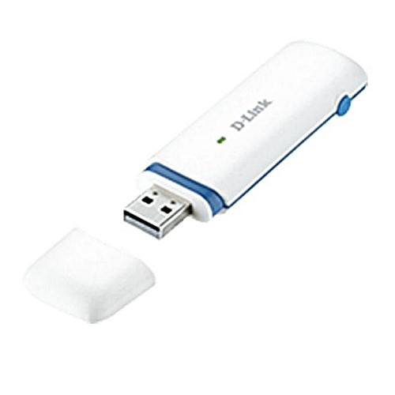
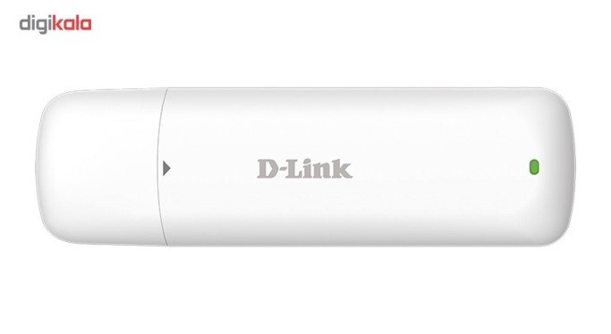

## مودم‌های GSM قابل پشتیبانی 

ارتباط نرم افزار پیام گستر با GSM مودم جهت ارسال پیام، با یکی از سه برند ذیل امکان پذیر می باشد.

**برندهایی که برای خرید توصیه می‌شوند:**

T-mobile

Dlink

Data net

> نکته: با توجه به اینکه GSM مودم روی سرورهای مجازی شناسایی نمی شود حتما باید روی سرور پیام گستر به صورت فیزیکی باشد.
در ضمن مودم می بایست به صورت DONGLE باشد . طبق عکس زیر:

