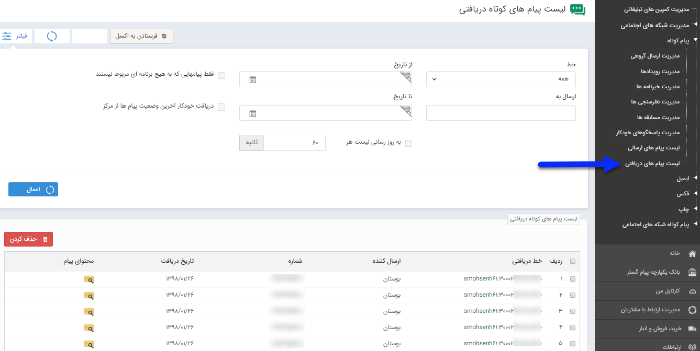

## لیست پیام های دریافتی

در این پنجره تمام پیام کوتاه هایی به شماره شما ارسال شده است، نمایش داده می شود. شماره خط و ارسال کننده و همچنین تاریخ ارسال نمایش داده می شود.

 همچنین می توان لیست پیام ها را با فاکتورهایی مانند تاریخ دریافت ، یا بازه ای بین دو تاریخ ، شماره خط ارسال کننده ، خط دریافتی فیلتر نمود .

به روز رسانی لیست: با استفاده از این گزینه می توانید بر حسب ثانیه تعیین کنید که این لیست دریافت هر چند ثانیه یکبار به روز رسانی گردد.

فقط پیامهایی که به هیچ برنامه ای مربوط نیستند : پیام هایی نمایش داده می شود که مخاطب به شماره شما راسال کرده اما پیامک دریافتی مربوط به برنامه های تبلیغاتی مثل مسابقه نیست ،

ستون  محتوای پیام ، متن پیام ارسال شده را به شما نمایش می دهد

فرستادن به اکسل: دکمه ای در انتهای لیست تعبیه شده تا خروجی کاملی از لیست پیام های دریافتی در اکسل به شما بدهد.

