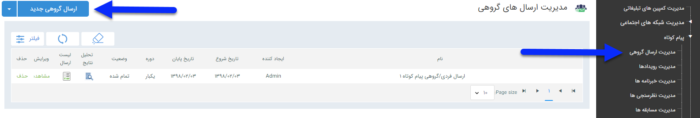

## مدیریت ارسال گروهی 

در این قسمت امکان تعریف برنامه های ارسال گروهی برای مخاطبان مورد نظر وجود دارد

.لطفا ابتدا اطلاعات مشترک ابزارها را مطالعه فرمایید و طبق گام های زیر برای ارسال گروهی جدید اقدام فرمایید.

[گام اول - اطلاعات اولیه ارسال گرو هی](https://github.com/1stco/PayamGostarDocs/blob/master/help%202.5.4/Marketing/moshtarak-abzar/gam%20yk/gam-yk.md)

[گام دوم - محتوای پیام](https://github.com/1stco/PayamGostarDocs/blob/master/help%202.5.4/Marketing/moshtarak-abzar/gam%20do/gam-do.md)

[گام سوم -انتخاب مخاطبان](https://github.com/1stco/PayamGostarDocs/blob/master/help%202.5.4/Marketing/moshtarak-abzar/gam%20se/select-Audience.md)

برای اجرای یک برنامه جدید باید بر روی دکمه"ارسال گروهی جدید" در سمت راست و بالای صفحه کلیک کرده و با گذراندن چند گام ساده، برنامه را به راحتی اجرا کنید.

لیست برنامه های تنظیم شده ی قبلی  در کادر پایین صفحه نمایش داده می شود و از همین قسمت می توانید تاریخ اجرا، وضعیت برنامه را مشاهده کنید و همچنین با کلیک بر روی مشاهده تحلیل نتایج برنامه ، نتایج ارسال و نمودارهای تحلیلی برنامه را مشاهده کنید.

> نکته:  برنامه هایی که وضعیت آن ها تمام شده است قابلیت ویرایش ندارند و ویرایش تنها برای برنامه های تازه درج شده است.

> نکته: می توان با تعیین عنوان برنامه و یا تاریخ اجرا و زدن دکمه فیلتر، لیست برنامه های اجرا شده در گذشته را بر اساس پارامتر مشخص شده مشاهده کرد.

وضعیت:  در این ستون، می توانید وضعیت فعلی ارسال فردی/گروهی را مشاهده نمایید. حالت تمام شده به معنای  تشکیل لیست کامل مخاطبان است. تازه درج شده به معنای ثبت برنامه و درانتظار جهت ارسال (ایجاد لیست ارسال) می باشد. در حال اجرا  یعنی لیست ارسال بصورت کامل تشکیل نشده است ، ممکن است برنامه برای مثال دوره ای باشد و تا پایان کامل در حال اجرا نمایش داده می شود .
