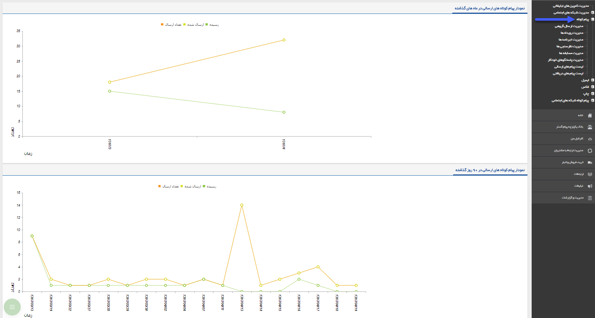

## پیام کوتاه

> مسیر دسترسی:  **تبلیغات** >**پیام‌کوتاه** 

در این بخش امکان مشاهده گزارش از ارسال پیام ها، بصورت نموداری می باشد که شامل دو نمودار می باشد :

نمودار پیام کوتاه های ارسالی در ماه های گذشته :  بصورت خودکار سه ماه گذشته نمایش داده می شود ، که در هر کدام از این ماه ها چه تعداد پیام ارسال شده و چه تعداد به مخاطب رسیده است .  

 

نمودار پیام کوتاه های ارسالی در 90 روز گذشته:  در این قسمت گزارش نموداری ارسال پیام ها در 90 روز گذشته نمایش داده می شود ، که در هر روز چه تعداد پیام ارسال شده و چه تعداد پیام رسیده به مخاطب داشتیم . 

<a href="send-group%2Fsend-group.md" target="_blank">مدیریت ارسال گروهی</a>

 <a href="Advertising-event%2Fadvertising-event.md" target="_blank">رویداد تبلیغاتی</a>
   
 <a href="Newsletters%2Fnewsletters.md" target="_blank">خبرنامه</a>
     
<a href="survey%2Fsurvery.md" target="_blank">نظرسنجی</a>

<a href="Competition%2Fcompertition.md" target="_blank">مسابقه</a>
     
<a href="Autoresponder%2Fautoresponder.md" target="_blank">پاسخگوی خودکار</a>
    
<a href="resive-list%2Fresive-list.md" target="_blank">پیام های دریافتی</a>
  
<a href="Send-ist%2FSend%20list.md" target="_blank">پیام های ارسالی</a>

