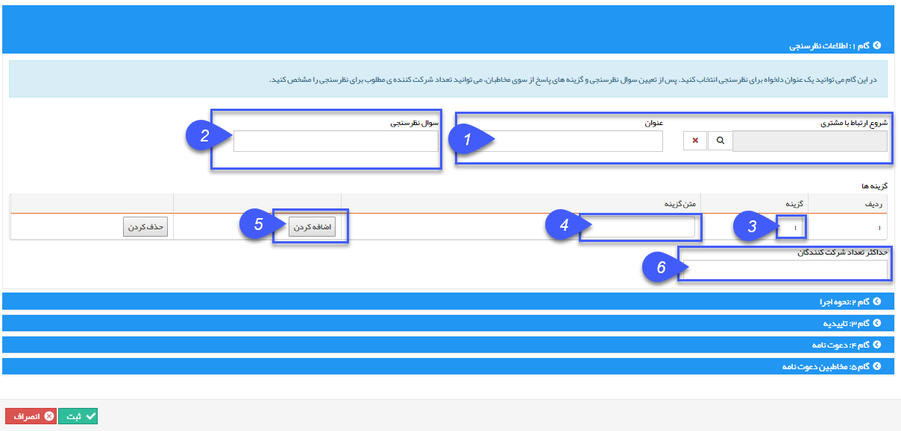

## گام1- اطلاعات اولیه نظر سنجی

> مسیر دسترسی:  **تبلیغات** >**پیام‌کوتاه** > **مدیریت نظرسنجی** > **نظرسنجی جدید>**اطلاعات نظرسنجی**** 

1. شروع ارتباط با مشتری و عنوان: در صورت تمایل، می توان کمپین تبلیغاتی مشخصی را به این نظرسنجی متصل کرد تا تعداد پیام های ارسالی در هزینه های آن کمپین محاسبه گردد و یک عنوان برای نظرسنجی تعیین کرد.

2. تعیین سوال نظر سنجی: سوال مورد نظر برای نظر سنجی را در این کادر ثبت می نمایید.

3. تعیین گزینه ها : در این قسمت، شماره گزینه ها را باید تعیین کنید، دقت شود که مخاطبان از شماره گزینه ها بعنوان متن ارسالی جهت شرکت در نظرسنجی استفاده خواهند کرد.

4. متن گزینه: عنوان هر گزینه جهت ارسال نظر از سمت مخاطبان در این قسمت تعیین می شود.

5. اضافه کردن : ابتدا جهت تعریف گزینه ها، دکمه اضافه کردن را بفشارید تا امکان ایجاد گزینه ها فراهم شود و همچنن : در هر مرحله بازدن دکمه اضافه کردن، یک گزینه دیگر می توانید تعریف نمایید.

6. حداکثر تعداد شرکت کنندگان : با استفاده از این گزینه امکان محدود کردن تعداد مخاطبان وجود دارد

با کلیک بر روی گام 2 وارد مرحله بعد می شویم.

