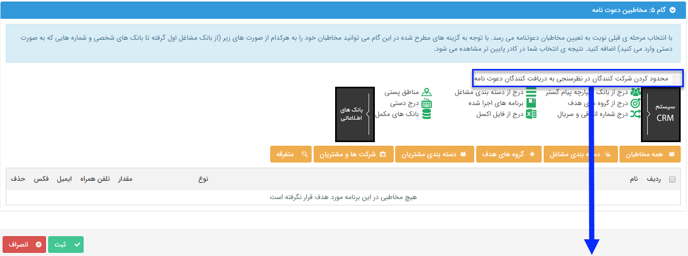

## گام5-انتخاب مخاطبان دعوتنامه

اگر در گام 4 تصمیم به ارسال دعوتنامه گرفته باشید، در این گام باید مخاطبان دعوتنامه را تعیین کنید.

در قسمت <a href="C%3A%2FUsers%2FH.abasi%2FDesktop%2Fhelp%2Fmd%20help%2F%D8%AA%D8%A8%D9%84%DB%8C%D8%BA%D8%A7%D8%AA%2Fmoshtarak-abzar%2Fgam%20se%2Fselect-Audience.md" target="_blank">انتخاب مخاطبان  </a> توضیح داده شده است.  

> نکته: در صورتی که ارسال دعتونامه را در این قسمت فعال کرده باشید، این برنامه حداقل باید یک مخاطب داشته باشد تا اجرا شود.

