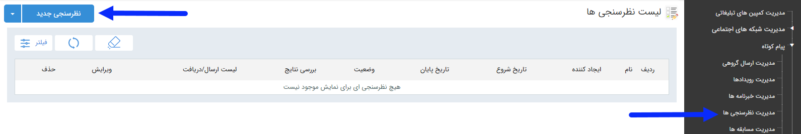

## نظرسنجی

برای آگاهی از نظرات مخاطبان خود در جهت بهبود برنامه های بازاریابی ، فروش و ... می توانید از نظرسنجی استفاده کنید. در صفحه اول، می توان با تعیین تاریخ اجرا،ایجاد کننده و نام برنامه  و زدن دکمه فیلتر، لیست برنامه های اجرا شده در گذشته را مشاهده کرد. اما برای اجرای یک برنامه جدید باید بر روی دکمه  "نظرسنجی جدید" در سمت راست و بالای صفحه کلیک کرده و با گذراندن چند گام ساده، برنامه را به راحتی اجرا کرد

لطفا ا<a href="C%3A%2FUsers%2FH.abasi%2FDesktop%2Fhelp%2Fmd%20help%2F%D8%AA%D8%A8%D9%84%DB%8C%D8%BA%D8%A7%D8%AA%2Fmoshtarak-abzar%2Fmoshtarak-abzar.md" target="_blank">  اطلاعات مشترک ابزارها</a>بتدا را مطالعه فرمایید و طبق گام های زیر برای ارسال گروهی جدید اقدام فرمایید.

<a href="1-avalie-nazarsanji%2Favalie-nazarsanji.md" target="_blank">گام1-اطلاعات نظرسنجی</a>

<a href="2-nahveajra-nazaesanji%2F2-nahve-ejra-nazarsanji.md" target="_blank">گام2-نحوه اجرا</a>

<a href="3-taid-nazarsanji%2F3-taid-nazarsanji.md" target="_blank">گام3- تاییدیه</a>

<a href="4-davatname-nazarsanji%2Funtitled.md" target="_blank">گام4- دعوتنامه</a>

<a href="5-mokhatab-davatname%2F5-entekhabmokhatab-nazarsanji.md" target="_blank">گام5-مخاطبین دعوتنامه</a>

