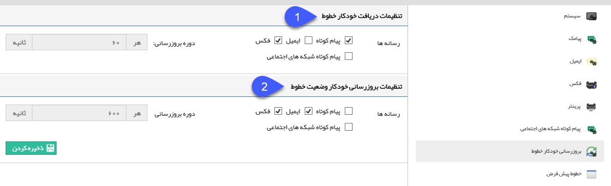

## بروزرسانی خودکار خطوط

از این قسمت می توانید زمان بروزرسانی لیست پیام های دریافتی و ارسالی خطوط را تنظیم نمایید.

1. تنظیمات دریافت خودکار خطوط: رسانه هایی که پیام های دریافتی آن ها، هر ۱ دقیقه باید بروزرسانی شوند را تعیین نمایید.

2. تنظیمات بروز رسانی خودکار وضعیت خطوط: رسانه هایی که باید هر ۱۰ دقیقه وضعیت پیام های ارسالی آنان بررسی شود را تعیین نمایید.

> نکته : لازم به ذکر است برای تنظیمات به روز رسانی ایمیل ها بایستی از بخش ایمیل ها در تنظیمات کلی اقدام نمایید.

