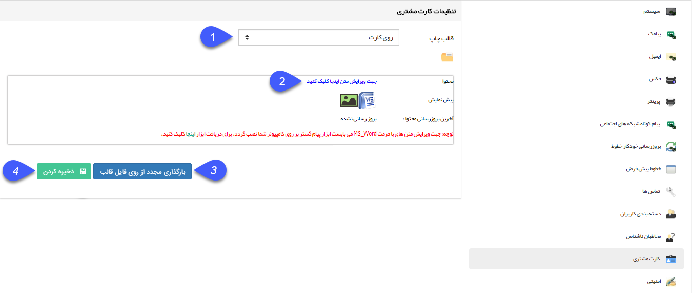

## کارت مشتری

در صورتی که ماژول مربوط به چاپ کارت برای مشتریان فعال باشد می توانید از طریق این قسمت  قالب رو و پشت کارت را طراحی و ذخیره نمایید تا بتوانید برای مشتریان خود کارت چاپ کنید. (برای اطلاع از نحوه چاپ کارت مشتری به[ مشخصات عمومی](https://github.com/1stco/PayamGostarDocs/blob/master/help%202.5.4/Integrated-bank/Database/General-specifications/General-specifications.md) مراجعه کنید.)

تجهیزات مورد نیاز: پرینتر چاپ کارت

1. قالب چاپ: تعیین کنید که قالبی که می خواهید طراحی کنید برای روی کارت و یا پشت کارت استفاده شود.

2. محتوا: برای اطلاع از نحوه ویرایش قالب چاپ به [تنظیم قالب چاپ](https://github.com/1stco/PayamGostarDocs/blob/master/help%202.5.4/Settings/Personalization-crm/Overview/General-information/Set%20the-print-template/Set%20the-print-template.md) مراجعه کنید.

3. بارگذاری مجدد از روی قالب: در صورتی که بخواهید قالب را به حالت اولیه (پیشفرض سیستم) برگردانید، از دکمه بارگذاری مجدد از روی فایل قالب استفاده کنید.

4. ذخیره کردن: بعد از طراحی قالب و زدن دکمه ذخیره و ارسال به سرور، دکمه ذخیره کردن صفحه اصلی تنظیمات کارت مشتری را نیز انتخاب کنید .

