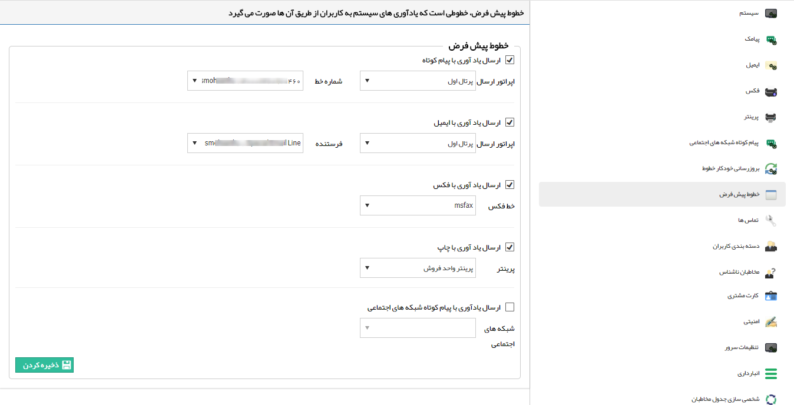

## خطوط پیشفرض

خطوط پیش فرض خطوطی است که یادآوری های سیستم از طریق آن خطوط صورت میگیرد، مانند پیامکی که در صورت اختصاص یک وظیفه به کاربر و یا پیام هایی که به صورت خودکار در فرآیندهای نرم افزار تعریف شده اند، از طریق آن ها صورت می گیرد.  برای هریک از رسانه ها، خط پیشفرض خود را در این قسمت مشخص کنید.

