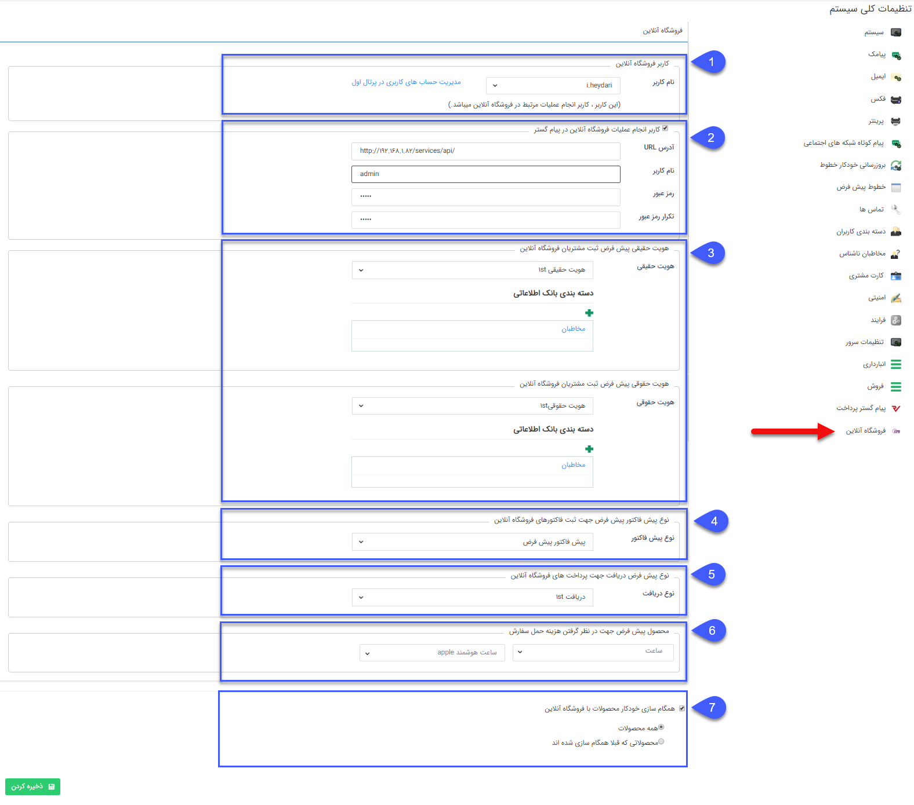

## فروشگاه آنلاین

ارتباط با فروشگاه آنلاین به منظور ایجاد امکان فروش محصولات، پیام گستر در فروشگاه تجارت اول (1ST) ایجاد شده و این ارتباط به صورت دو طرفه در تعریف و تغییر محصولات و همچنین موجودی محصول عمل می کند.

لازم به ذکر است که صدور پیش فاکتور فروش نیز پس از عملیات فروش در فروشگاه آنلاین باید در پیام گستر انجام شود. همچنین در صورتی که هویت مرتبط با فاکتور، در پیام گستر موجود نباشد، به صورت اتوماتیک ایجاد می شود.

> نکته: پیش از مطالعه تنظیمات فروشگاه آنلاین مربوط به پیام گستر، توضیحات مربوط به فروشگاه آنلاین در تجارت اول را مطالعه کنید.

تنظیمات فروشگاه آنلاین:

برای ارتباط با فروشگاه آنلاین، باید تنظیمات اولیه را به سیستم وارد کنید.

> نکته: تنها کاربری که مجوز "مدیریت محصولات" را دارد می تواند تنظیمات مربوط به فروشگاه آنلاین را انجام دهد.

با دسترسی به صفحه تنظیمات فروشگاه آنلاین کاربر باید تنظیمات زیر را انجام دهد:

1. حساب کاربری فروشگاه  آنلاین:

به دلیل اینکه در ارتباط دو طرفه سیستم ها، آیتم هایی ایجاد شده و یا ویرایش می شوند، لازم است که کاربرانی به عنوان ایجاد کننده یا ویرایش کننده در نظر گرفته شوند. این کاربران باید مجوزهای لازم برای انجام این عملیات را داشته باشند.

به این ترتیب کاربر، بخش تنظیمات فروشگاه آنلاین باید از بین حساب های کاربری فروشگاه آنلاین که قبلا در پیام گستر احراز شده اند، یکی را به عنوان کاربر مرتبط با پیام گستر، در فروشگاه آنلاین انتخاب نماید. این به این معنی است که این حساب کاربری در فروشگاه آنلاین، حساب متناظر با کاربر پیام گستر، برای انجام کلیه عملیات می باشد. لازم است که این کاربر حتما در فروشگاه آنلاین به عنوان "فروشنده" به ثبت رسیده باشد و همچنین دارای شرکت باشد. در مراحل بعدی با فراخوانی سرویس از فروشگاه آنلاین، اطلاعات کاربر بررسی شده، و در صورتی که این نکات برقرار نباشد، امکان ذخیره سازی کاربر در تنظیمات فروشگاه آنلاین موجود نخواهد بود .

در زمان وارد کردن اطلاعات کاربر فروشگاه آنلاین، کاربر می تواند با دسترسی به امکان تعریف کاربر در فروشگاه آنلاین، یک کاربر ایجاد کرده و این کاربر را به عنوان کاربر مورد نظر در تنطیمات انتخاب کند.

2. کاربر انجام عملیات فروشگاه آنلاین در پیام گستر :

در این بخش کاربر می تواند اطلاعات کاربری خود را جهت همگام سازی با فروشگاه آنلاین به سیستم وارد کند. به این ترتیب مشخص خواهد شد که فروشگاه آنلاین با کدام نرم افزار پیام گستر در ارتباط بوده و فعالیت های مربوط به این حوزه تحت کدام نام کاربری و مجوز های مربوط به آن انجام می شود. یکبار وارد کردن اطلاعات صحیح این کاربر به سیستم برای برقراری ارتباط الزامی می باشد ولی در دفعات بعدی، کاربر در صورت نیاز می تواند این اطلاعات را بروزرسانی کند.

 فیلد های زیر به کاربر نمایش داده می شود:

URL  : URL  نمونه ای از نرم افزار پیام گستر که کاربر در آن در حال کار کردن است می باشد. این اطلاع به صورت خودکار تشخیص داده می شود. این فیلد باید برای کاربر قابل ویرایش است.

نام کاربری: این فیلد به صورت سیستمی با نام کاربری کاربر جاری مقداردهی می شود. این فیلد برای کاربر غیر قابل ویرایش می باشد.

 رمز عبور/ تکرار رمز عبور:  این فیلد باید توسط کاربر به سیستم وارد شود. پس از اینکه کاربر رمز عبور را برای بار دوم به سیستم وارد کرد، سیستم یکسان بودن دو فیلد رمز عبور را بررسی کرده و در صورت عدم تطابق، به کاربر پیغام می دهد.
 
  3. نوع هویت/ دسته بندی:

  در این بخش کاربر انواع هویت های حقیقی و حقوقی تعریف شده با نوع هویت"مشتری" را به تفکیک حقیقی و حقوقی، در اختیار داشته و نوع هویت مورد نظر برای ثبت هویت های دریافتی از فروشگاه آنلاین را مشخص می کند. با انتخاب هر کدام از انواع هویت، کاربر باید دسته بندی مورد نظر برای ایجاد هویت در دسته بندی را نیز مشخص کند.

4. نوع پیش فاکتور پیش فرض جهت ثبت فاکتورهای فروشگاه آنلاین:

در این بخش کاربر از بین انواع زیرنوع آیتم های مربوط به پیش فاکتور یکی را انتخاب می کند.

 5. نوع پیش فرض دریافت جهت پرداخت های فروشگاه آنلاین:

در این بخش کاربر از بین انواع زیرنوع آیتم های مربوط به دریافت یکی را انتخاب می کند.

6. محصول پیش فرض جهت در نظر گرفتن هزینه حمل سفارش:

سفارشاتی که از فروشگاه آنلاین ثبت می شوند دارای هزینه حمل می باشند. با توجه به اینکه در پیام گستر فیلدی برای هزینه حمل وجود ندارد، یک محصول با نام هزینه حمل باید در پیام گستر ایجاد شود و در این قسمت انتخاب شود.

هزینه حمل مرتبط با فاکتور در فروشگاه آنلاین به عنوان یک ردیف محصول در پیش فاکتور پیام گستر درج می شود.

7. همگام سازی خودکار محصولات با فروشگاه آنلاین:

این گزینه به صورت پیش فرض غیرفعال است. کاربر می تواند با انتخاب این گزینه مشخص کند که در زمان ایجاد یا ویرایش محصولات، تغییرات ایجاد شده به صورت خودکار به فروشگاه آنلاین ارسال شوند.

همگام سازی اتوماتیک محصولات از پیام گستر به فروشگاه آنلاین به دو شیوه زیر امکان پذیر است:

1. همه محصولات: در صورت فعال سازی این گزینه تمامی محصولاتی که در پیام گستر ایجاد و یا ویرایش می شوند در زمان ذخیره سازی، به همراه موجودی در فروشگاه آنلاین ایجاد و یا ویرایش می شوند.

 2. محصولاتی که قبلا همگام سازی شده اند: با فعال سازی این گزینه تنها تغییرات محصولاتی که قبلا به فروشگاه آنلاین ارسال شده اند، با هر بار ذخیره سازی، به فروشگاه آنلاین ارسال می شود. منظور از تغییرات، تغییر در خصوصیات محصول و موجودی می باشد.

> نکته: محصولات و گروه های ارسالی به فروشگاه آنلاین با ساختار درختی ای که در آن قرار دارند به فروشگاه آنلاین انتقال می یابند. به این معنی که مسیر دسته بندی محصول از خود محصول تا ریشه درخت، در فروشگاه آنلاین ساخته خواهد شد.

برای مطالعه شیوه همگام سازی محصولات به صورت دستی، به[  ارسال به فروشگاه آنلاین](https://github.com/1stco/PayamGostarDocs/blob/master/help%202.5.4/Basic-Information/Product%20management/Online-shop/Online-shop.md)  رجوع کنید.

دریافت و ثبت پیش فاکتور از فروشگاه آنلاین

دریافت فاکتورهای فروشگاه آنلاین به صورت خودکار و با استفاده از فراخوانی سرویس های پیام گستر پس از صدور فاکتور در فروشگاه آنلاین انجام می شود. در این مورد نکات زیر حائز اهمیت می باشد:

1- فاکتور دریافتی از فروشگاه آنلاین، در پیام گستر به عنوان پیش فاکتور ثبت شده و مشمول روال های صدور فاکتور در پیام گستر خواهد بود.

2- در صورتی که خریدار فاکتور قبلا در هویت های پیام گستر ثبت نشده باشد، هویتی با نوع هویت مرتبط ایجاد می شود.

3- در صورتی که محصول فاکتور در پیام گستر موجود نباشد، محصول و درختواره آن در فروشگاه آنلاین در پیام گستر ثبت می شود.

> نکته: در زمان دریافت فاکتور های فروشگاه آنلاین، در صورتی که محصولی که در فروشگاه آنلاین به فروش رسیده در پیام گستر موجود نباشد، این محصول به همراه ساختار درختی محصول در فروشگاه آنلاین، در پیام گستر ایجاد خواهد شد.

 4 - پرداخت مشتری در فروشگاه آنلاین به عنوان یک دریافت در پیام گستر ثبت می شود.
