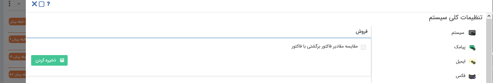

## فروش

>  مسیر دسترسی:  **تنظیمات** >**تنظیمات کلی** > **فروش** 

در تنظیمات کلی نرم‌افزار، بخش فروش در صورت فعال بودن این گزینه، هنگام صدور فاکتور برگشتی، حتما باید ارتباط با یک فاکتور برقرار شود تا موجودی برگشتی قابل کنترل باشد.

در صورت غیر فعال بودن این گزینه میتوانید بدون اتصال یک فاکتور برگشتی به فاکتور مرتبط به آن ، یک فاکتور برگشتی صادر کنید.

