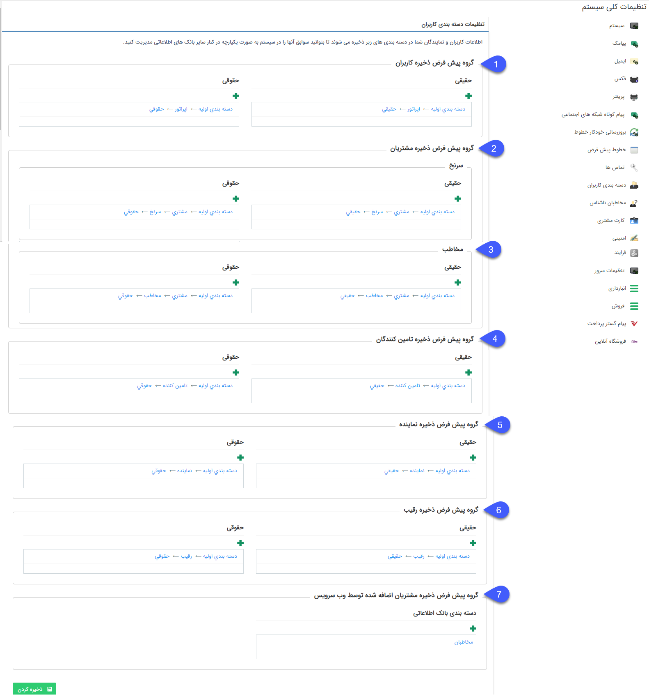

## دسته بندی کاربران

در این قسمت مسیر پیشفرض ذخیره پروفایل مرتبط با کاربران نرم افزار، مشتریانی که کاربری باشگاه مشتریان دریافت می کنند و هویت هایی که از طریق وب سرویس (مثلا نرم افزار مالی) به پیام گستر منتقل می شوند را مشخص کنید.

1. گروه پیش فرض ذخیره کاربران: با انتخابدسته بندی مورد نظر در  این قسمت، بعد از اینکه کاربری جدید برای پیام گستر در بخش مدیریت گروه ها و کاربران و یا از  طریق بخش ایجاد

کاربر بخش مشخصات هویت ایجاد میگردد، اطلاعات آن ها در این دسته بندی های انتخاب شده  ذخیره می شود.

>   نکته: تعیین این گزینه جهت ایجاد کاربر جدید الزامی می باشد.

2. گروه پیش فرض ذخیره مشتریان: در صورتی که ماژول[ باشگاه مشتریان](https://github.com/1stco/PayamGostarDocs/blob/master/help%202.5.4/Supplementary-modules/customer-club%2Fcustomer-club.md) را خریداری کرده باشید، با ساختن یک دسته بندی در بانک اطلاعاتی و انتخاب آن در گروه پیش فرض مشتریان، پروفایل متناظر با مشتریانی که در در باشگاه ثبت نام می کنند یا کاربری آن ها از قسمت[ مدیریت اعضای باشگاه مشتریان](https://github.com/1stco/PayamGostarDocs/blob/master/help%202.5.4/Settings/Management-of-customer-club-members/Management-of-customer-club-members.md) ایجاد می شود، در این دسته بندی ساخته می شود. 

نکته: تعیین این گزینه برای امکان ثبت نام مشتریان در باشگاه، الزامی است.

3. گروه پیش فرض ذخیره مخاطب:  با ساختن یک دسته بندی در بانک اطلاعاتی و انتخاب آن در قسمت تنظیمات کاربران به عنوان گروه پیش فرض مخاطب، پس از ساختن هویت جدید از نوع مخاطب، پروفایل متناظر با مخاطب و اطلاعات آن ها در این دسته بندی ذخیره می شود.

 > لازم به ذکر است در صورت ایجاد هویت بصورت چابک، دسته بندی هویت با توجه به نوع هویت ایجاد شده، از قسمت 2 و 3 تعیین میگردد.

4. گروه پیش فرض ذخیره تامین کننده: با ساختن یک دسته بندی در بانک اطلاعاتی و انتخاب آن در قسمت تنظیمات کاربران به عنوان گروه پیش فرض تامین کننده، پس از

ساختن هویت جدید از نوع تامین کننده، پروفایل متناظر با هویت و اطلاعات آن ها در این دسته بندی ذخیره می شود.

5. گروه پیش فرض ذخیره نماینده: با ساختن یک دسته بندی در بانک اطلاعاتی و انتخاب آن در قسمت تنظیمات کاربران به عنوان گروه پیش فرض نماینده،پس از ساختن هویت جدید از

نوع  نماینده، پروفایل متناظر با هویت و اطلاعات آن ها در این دسته بندی ذخیره می شود.

6. گروه پیش فرض ذخیره رقیب: با ساختن یک دسته بندی در بانک اطلاعاتی و انتخاب آن در قسمت تنظیمات کاربران به عنوان گروه پیش فرض رقیب، پس از ساختن هویت جدید از نوع

رقیب، پروفایل متناظر با هویت و اطلاعات آن ها در این دسته بندی ذخیره می شود.

7. گروه پیش فرض ذخیره مشتریان اضافه شده توسط وب سرویس: در صورتی که وب سرویسی برای ذخیره هویت نیز تهیه و فعال کرده باشید، هویت هایی که از این طریق ایجاد می شوند در این دسته بندی ذخیره می شوند.