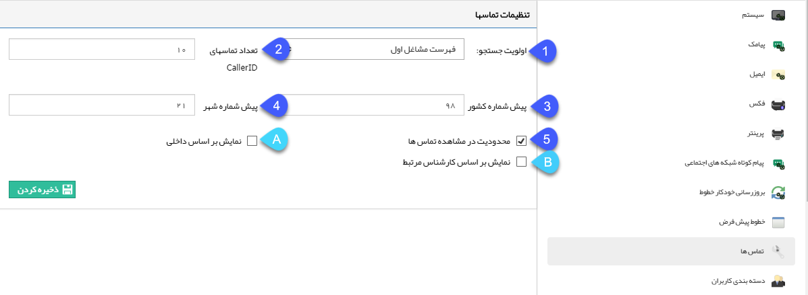

## تماس ها

> مسیر دسترسی:  **تنظیمات** >**تنظیمات کلی** > **تماس‌ها** 

در صورتی که ماژول نمایشگر تماس را خریداری کرده باشید از تنظیمات کلی نرم‌افزار بخش تماس‌ها تنظیمات آن صورت خواهد گرفت.

1.اولویت جستجو: می توانید تعیین کنید که هنگام برقراری تماس یک مخاطب، نرم افزار جستجو در بانک مشاغل اول یا مشتریان من را در اولویت قرار دهد. در صورتی که شماره ای هم در یکی از هویت های بانک مشاغل اول و هم در اطلاعات یک هویت ثبت شده توسط شما ذخیره شده باشد، اولویت جستجوی مشخص شده در این قسمت برای نمایش پروفایل مرتبط با تماس گیرنده، حائز اهمیت است.

2. تعداد تماسها نمایشگر تماس (CallerID) : حداکثر تعداد تماسهایی که در پنجره تماسهای تلفنی دیده می شود را می توانید تعیین کنید.

3. پیش شماره کشور:  عدد 98 پبش شماره برای کشور ایران است.

> نکته: با تعریف پیش شماره در این بخش درقسمت تعریف شماره تماس  برای مثال اطلاعات ارتباطی هویت ها ، پیش شماره کشور بصورت پیش فرض نمایش داده خواهد شد.

4. پیش شماره شهر: عدد پیش شماره شهر خود را بدون ۰ وارد کنید.

5. محدودیت مشاهده تماس ها: با فعال کردن این گزینه پنجره تماس های تلفنی هر کاربر تنها تماس هایی مرتبط با او را نشان می دهد. (برای تنظیم داخلی کاربران به مدیریت گروه ها و کاربران مراجعه کنید.)

این امکان دوحالت دارد:

A. نمایش بر اساس داخلی : پنجره تماس تلفنی هر کاربر را بر حسب داخلی آن مجزا می کند.

B. نمایش بر اساس کارشناس مرتبط:  هر مخاطب را در پنجره تماس تلفنی کارشناسان مرتبط نمایش می دهد. ( در خصوص کارشناس مرتبط به مشخصات عمومی مراجعه کنید.)

> نکته: در صورتی که سیستم سانترال باشد عمال محدود کردن تماسها براساس داخلی ساپورت نمی شود چون در تماسهای ورودی سانترال زمانی داخلی تشخیص داده میشود که تماس قطع شده باشد. برای سیستمهای سانترال و خطوط مستقیم می توان از محدود کردن تماس براساس کارشناس پروفایل استفاده شود. . با توجه به توضیحات انجام شده پاپ آپ پروفایل در سیستمهای تلفنی سانترال فقط براساس محدود کردن تماسها براساس کارشناس پروفایل امکان پذیر است.(

با توجه به توضیحات انجام شده نمایش تماس‌ها در صورت محدود کردن تماسها براساس داخلی فقط در سیستمهای ویپ امکان پذیر است.

