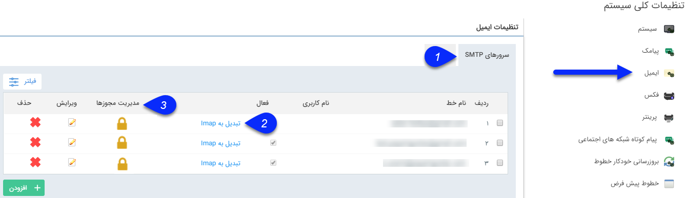

## صفحه‌ی اصلی خطوط ایمیل

> مسیر دسترسی:  **تنظیمات** >**تنظیمات کلی** > **ایمیل** > **سرورهای smtp** 

برای تنظیم ایمیل های مورد استفاده در نرم افزار و ارسال پیام از طریق آن ها ، از این قسمت اقدام نمایید.

**1.سرورهای SMTP:** در این بخش می توانید خطوط ارسال ایمیل از طریق سرورهای SMTP را مدیریت کنید. شما می توانید از طریق کلیه ارائه دهندگان سرویس SMTP ایمیل خود را ارسال نمائید. برای مثال اگر می خواهید ایمیل های خود را از طریق Gmail شخصی و یا شرکت خود ارسال نمایید، کافیست با ایجاد یک خط جدید و درج تنظیمات مربوطه، ایمیل های خود را از طریق Gmail ارسال کنید.

**2.تبدیل به Imap:**
در صورتی که سرور دریافت ایمیلی در نرم افزار به صورت pop3 تعریف شده باشد، با کلیک روی این گزینه به Imap تبدیل می شود.

نکته: توجه کنید که سرور pop3 امکان تبدیل به Imap دارد اما سرور های Imap به pop3 تبدیل نمی شوند.

> نکته: توجه کنید که سرور pop3 امکان تبدیل به Imap دارد اما سرور های Imap به pop3 تبدیل نمی شوند.

**3.مدیریت مجوزها:** از این قسمت می توانید سطوح دسترسی کاربران مختلف به خط مورد نظر را مشخص کنید.

با کلیک بر روی این قسمت لیست مجوز های تعریف شده برای کاربر  بر روی این خط را میتوانید مشاهده کنید، همچنین با کلیک بر روی دکمه افزودن میتوانید، مجوز جدیدی برای خط تعریف کنید.

سه دسترسی زیر قابل تخصیص می باشند:

ارسال: دسترسی ارسال از این خط را به کاربر می دهد.

دریافت: دسترسی به صندوق دریافت روی این خط را به کاربر می دهد.

لیست سیاه: امکان دسترسی به لیست سیاه را به کاربر می دهد.

> نکته : در صورت اینکه هیچ گونه مجوزی روی یک خط تعریف نکنید، این خط به صورت عمومی لحاظ میگردد و همه کاربران سیستم به آن دسترسی کامل دارند، به محض اینکه شما برای کاربر خاصی روی این خط مجوز تعریف میکنید، تنها کاربر مورد نظرتان به این خط دسترسی دارد.

