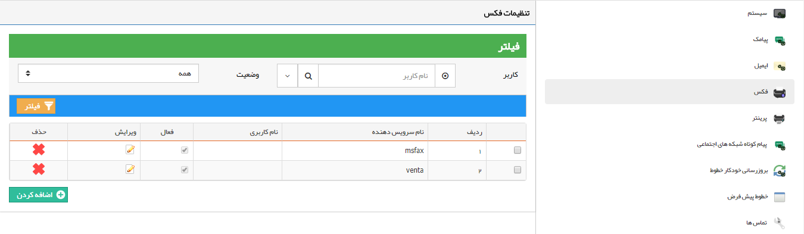
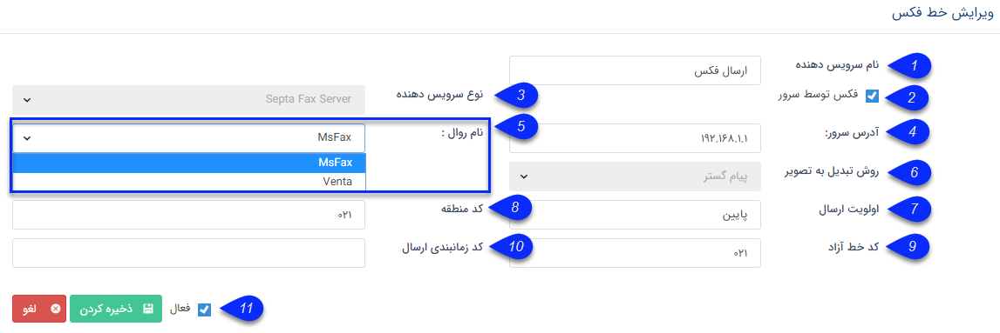

## فکس

برای ارسال فکس می توان سرویس دهنده های مختلفی را تعریف نمود، که هر کدام از آن ها تنظیمات جداگانه ای دارد .

> نکته ۱: سخت افزار فکس مودم برای ارسال فکس با هر حالتی نیاز است.

> نکته ۲: خط تلفن می تواند به صورت خط مستقیم و یا سانترال باشد.

1. نام سرویس دهنده: به فکسی که تعریف می کنید نامی اختصاص دهید.

2. فکس توسط سرور: می توانید تعیین کنید که فکس توسط فکس سرور ارسال شود.

3. نوع سرویس دهنده: می توانید از (Microsoft Fax Server) فکس ویندوز و یا SeptaVentaFax برای ارسال فکس استفاده نمایید. ( راهنمای راه اندازی فکس ویندوز )

 می توانید نوع سرویس مورد استفاده برای فکس را تعیین نمایید.

4. آدرس فکس سرور: باید آدرس سرور و یا IP  آن در این قسمت به صورت faxserver و یا 127.0.0.1 وارد گردد.

5. نام روال: در صورتی که از فکس ویندوز استفاده می کنید روال msfax و در صورتی که از ونتا استفاده می کنید روال venta را انتخاب کنید.

6. روش تبدیل تصویر: روش تبدیل تصویر برای فکس را تعیین نمایید.

7. اولویت ارسال: اولویت ارسال برای هر کدام از کاربران می تواند یکی از گزینه های بالا، معمولی و یا پایین باشد.

8. کد منطقه: در این قسمت پیش‌شماره منطقه خود را وارد نمایید. مثلاً در شهر تهران در این قسمت باید کد 021 را وارد نمایید.

9.  برای ارسال فکس از خط مستقیم استفاده نمی شود.)

10. کد زمانبندی ارسال: یکی از ویژگی های سیستم  septaventafax تنظیم زمابندی ارسال است که با تعریف و انتخاب کد زمانبندی صورت می گیرد. شما می توانید مشخص نمایید که فکس های شما درهر یک از روز های هفته در چه بازه زمانی ارسال شود. 

11. فعال: می توانید این خط فکس را فعال و یا غیر فعال نمایید.