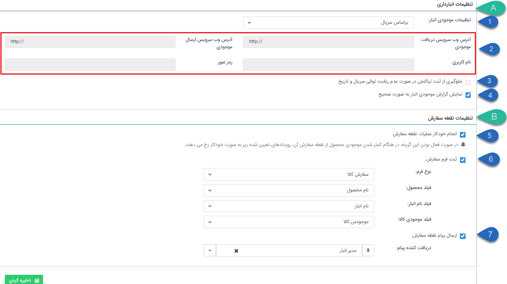

## انبار داری

در این قسمت می توانید نوع انبارداری مورد استفاده در نرم افزار را تعیین نمایید.

A. تنظیمات انبارداری:

1. تنظیمات موجودی انبار: این گزینه ۳ حالت مختلف دارد:

بر اساس تعداد: موجودی کالاها در قسمت[ مدیریت محصولات](https://github.com/1stco/PayamGostarDocs/blob/master/help%202.5.4/Basic-Information/Product%20management/Product-management.md) تعیین می شود و از طریق فاکتور های خرید  و فروش که برای محصولات ثبت میگردد، این موجودی تغییر میکند.

بر اساس وب سرویس: در صورتی که بخواهید از انبار داری براساس وب سرویس استفاده کنید،می توانید تنظیمات مرتبط با آن را در این قسمت انجام دهید. (برای مثال زمانی که بخواهید اطلاعات انبار از یک نرم افزار دیگر مانند نرم افزار مالی به پیام گستر منتقل گردد و در هنگام صدور فاکتور یا پیش فاکتور به کاربران نمایش داده شود)

بر اساس سریال: در صورت فعال بودن ماژول انبارداری، با انتخاب این گزینه می توانید انبارداری محصولات خود را از طریق ایجاد انبارهای مختلف و صدور رسید و حواله های مرتبط بر اساس سریال محصولات با آن انجام دهید. در این حالت موجودی کالاها بر اساس رسید و حواله های انبار تعیین شده و قسمت انبارداری در[ مدیریت محصولات](https://github.com/1stco/PayamGostarDocs/blob/master/help%202.5.4/Basic-Information/Product%20management/Product-management.md) غیر فعال می گردد.

2. وب سرویس: اگر انبارداری بر اساس وب سرویس تنظیم شده باشد باید آدرس ارسال و دریافت اطلاعات و همچنین نام کاربری و رمز عبور آنها را در این قسمت تنظیم نمایید.

3. جلوگیری از ثبت تراکنش در صورت عدم رعایت توالی سریال و تاریخ: با فعال بودن این گزینه، توالی سریال و تاریخ تراکنش های انبار حتما باید رعایت گردد و در صورت متناقض بودن آن، سیستم اجازه ثبت تراکنش را نخواهد داد. به طور مثال اگر در روز جاری یک تراکنش انبار با سریال 25 ثبت کنید، تراکنش های ثبت شده در روزهای آتی نمی توانند سریالی کمتر از 25 داشته باشند.

4. نمایش گزارش موجودی انبار به صورت صحیح: با فعال بودن این گزینه، تعداد محصولات در گزارش موجودی انبار و گزارش کاردکس کالا به صورت صحیح نمایش داده می شود.

B. تنظیمات نقطه سفارش:

در این قسمت می توانید تنظیماتی اعمال کنید که در صورت رسیدن میزان موجودی محصولات به نقطه سفارشی که برای آن محصول تعریف کرده اید، عملیاتی خودکار توسط سیستم انجام شود، این عملیات می تواند ارسال پیام به یک کاربر/گروه/سمت مشخص یا ایجاد یک فرم (مثلاً فرم سفارش خرید) باشد.

> نکته:  این نقطه سفارش در صورت استفاده از انبارداری تعدادی، در قسمت [مدیریت محصولات](https://github.com/1stco/PayamGostarDocs/blob/master/help%202.5.4/Basic-Information/Product%20management/Product-management.md) و در صورت استفاده از انبارداری سریالی به ازای هر انبار و در قسمت [مدیریت محصولات ](https://github.com/1stco/PayamGostarDocs/blob/master/help%202.5.4/Basic-Information/Product%20management/Product-management.md)در انبار تعیین می گردد.

5. برای انجام خودکار عملیات نقطه سفارش، این گزینه را فعال کنید و در گام های بعدی، نوع عملیات را مشخص کنید.

6.  ثبت فرم سفارش: در صورتی که قصد دارید هنگام رسیدن موجودی محصولات به نقطه سفارش، یک فرم توسط سیستم ایجاد گردد، این گزینه را فعال کنید و در گزینه های بعدی نوع فرم و فیلدهایی که نام محصول، نام انبار مربوطه و میزان موجودی محصول باید در آن ها درج شود را مشخص نمایید. این فرم در واقع باید برای سفارش گذاری و تامین موجودی می باشد و بنابراین می توانید با پیاده سازی چرخه کاری مناسب روی این فرم، سفارش گذاری محصولات را در زمان مناسب انجام دهید.

7.  ارسال پیام نقطه سفارش: در صورتی که قصد دارید هنگام رسیدن موجودی محصولات به نقطه سفارش، یک پیام به کاربر/گروه/سمت مشخصی ارسال گردد، این گزینه را فعال نموده و در فیلد بعدی کاربر/گروه/سمت دریافت کننده پیام را مشخص کنید. توجه کنید که این پیام از نوع پیام های سیستمی می باشد و می تواند از طریق رسانه های پیامک، ایمیل، پیام کوتاه شبکه اجتماعی نیز ارسال گردد.

> برای ویرایش متن پیام مرتبط با نقطه سفارش به [مدیریت پیام های سیستم](https://github.com/1stco/PayamGostarDocs/blob/master/help%202.5.4/Basic-Information/Manage-system-messages/Manage-system-messages.md) مراجعه کنید.

