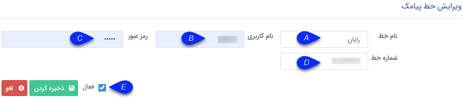

## تعریف خطوط رایان مارکتینگ

1. رایان مارکتینگ: برای ارسال از طریق خطوط ثابت، تنظیمات خط باید از این طریق صورت گیرد. با انتخاب دکمه اضافه کردن، پنجره ای نمایش داده می شود و می توانید اطلاعات مربوط به خط را در این پنجره وارد نمایید.

A. نام خط: نام خط به صورت انتخابی (دلخواه) است.

B. نام کاربری: نام کاربری که شما در سایت rayanmarketing.com می سازید و خط ثابت بر روی آن فعال می شود را در این قسمت وارد کنید.

C. رمز عبور: رمز عبور مربوط به کاربری خود در سایت rayanmarketing.com را در این قسمت وارد کنید.

D. شماره خط: شماره خط حتما باید به صورت "شماره خط-کدشهر-98" وارد شود.

E. وضعیت خط : وضعیت فعال بودن خط را مشخص کنید، در صورت نیاز می توانید در برهه های زمانی خاص، خط را در نرم افزار پیام گستر غیرفعال کنید تا کاربران نتوانند از آن استفاده کنند.

