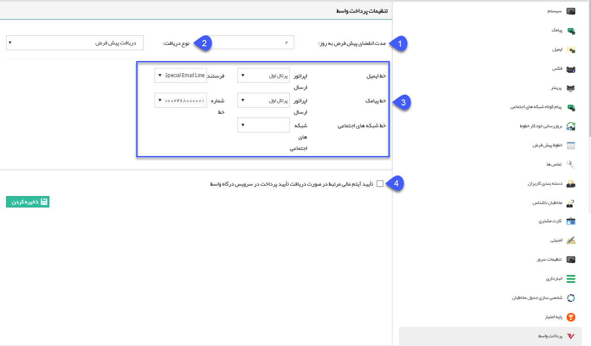

## پرداخت واسط

در صورتی که ماژول پرداخت واسط را تهیه کرده باشید، برخی از تنظیمات مرتبط با آن را باید از این قسمت انجام دهید.

1 . مدت انقضای پیش فرض: لینک های پرداخت ایجاد شده توسط سیستم دارای یک تاریخ انقضا هستند که با فرارسیدن آن تاریخ، امکان پرداخت از طریق لینک وجود ندارد، در این قسمت مدت انقضای پیشفرض را به روز وارد کنید.توجه داشته باشید در هنگام ایجاد هر لینک پرداخت، امکان تغییر این مقدار نیز وجود دارد.

 2 . نوع دریافت پیش فرض: پس از اینکه مخاطبان از طریق لینک ارسالی، عملیات پرداخت را انجام می دهند، یک دریافت در پروفایل آن ها در نرم افزار پیام گستر ثبت می گردد، نوع دریافت مورد نظر جهت ثبت را از بین زیرنوع های دریافت تعریف شده در شخصی سازی، در این قسمت انتخاب کنید.

3 . در این قسمت از بین خطوط تعریف شده، خط مورد نظر خود جهت ارسال پیام حاوی لینک پرداخت را برای هریک از رسانه های پیام کوتاه و ایمیل  مشخص نمایید. برای تنظیم متن پیام ها به قسمت  <a href="file%3A%2F%2F%2FC%3A%5CUsers%5CH.abasi%5CDesktop%5Chelp%5Cmd%20help%5CBasic-Information%5CManage-system-messages%5CManage-system-messages.md" target="_blank">مدیریت پیام های سیستم </a>مراجعه نمایید.

4 . در صورتی که می خواهید سند دریافت ثبت شده در پروفایل مخاطبان پس از انجام موفق عملیات پرداخت از طریق لینک، به صورت خودکار تایید شود این گزینه را فعال نمایید و در صورتی که تمایل دارید این دریافت برای تایید وارد کارتابل کاربرانی که مجوز تایید آن را دارند گردد، این گزینه را غیرفعال نمایید.

