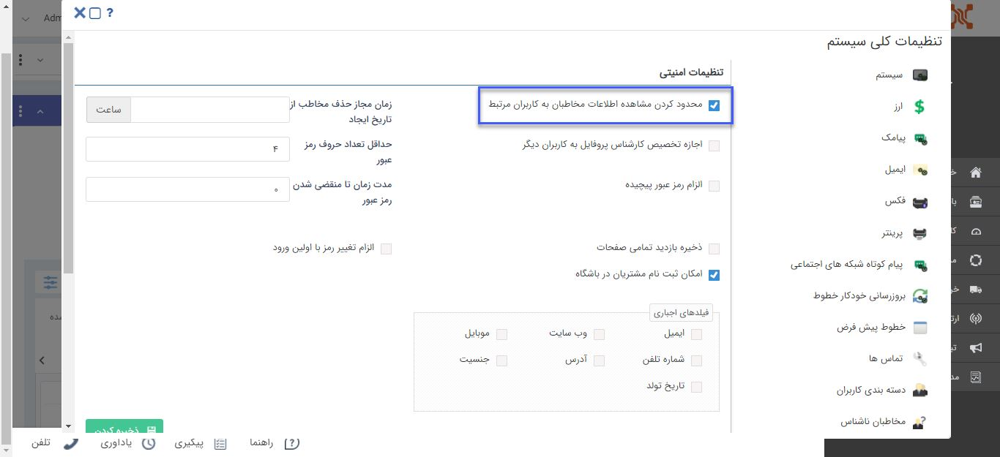

## تنظیمات امنیتی مشاهده‌ی هویت‌ها

> مسیر دسترسی:  **تنظیمات** >**تنظیمات کلی** > **امنیتی** 

در بخش امنیتی نرم‌افزار امکان محدود کردن مشاهده‌ی هویت‌ها به مسئولین پروفایل با فعال کردن چک باکس "محدود کردن مشاهده اطلاعات مخاطبان به کاربران مرتبط" وجود دارد.

منظور از کاربران مرتبط مسئول فروش، پشتیبانی و متفرقه می‌باشد که در صفحه [مشخصات مخاطب](https://github.com/1stco/PayamGostarDocs/blob/master/help%202.5.4/Integrated-bank/Database/General-specifications/General-specifications.md) مشخص شده اند. 

با فعال کردن این محدودیت کاربران دارای مجوز مشاهده‌ی نوع هویت هم دیگر امکان مشاهده‌ی آن هویت را ندارند. (  کاربران دارای مجوز مدیر بانک اطلاعاتی از این  محدودیت مستثنا هستند. )