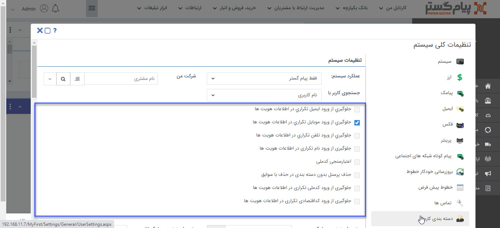

## مدیریت مخاطبان تکراری

> مسیر دسترسی:  **تنظیمات** >**تنظیمات کلی** > **سیستم** 

برای جلوگیری از ثبت اطلاعات تکراری هویت می‌توان از این بخش استفاده کرد.

با فعال کردن هر کدام از چک باکس‌های جلوگیری از ورود اطلاعات،  
 نرم افزار اجازه‌ی ورود اطلاعات تکراری به صورت دستی یا اکسل را نخواهد داد.  
 
 برای نمونه در صورت فعال کردن چک باکس "جلوگيري از ورود موبايل تکراري در اطلاعات هویت ها" دیگر امکان ثبت شماره موبایل تکراری وجود ندارد.
 
 
 
 **اعتبار سنجی کد ملی:** با فعال بودن این گزینه، تمامی کدملی هایی که در سیستم ثبت می شوند اعتبار سنجی شده و صحت آن ها بررسی می شود.
 
 **حذف پرسنل بدون دسته بندی:** با فعال کردن چک باکس "حذف پرسنل بدون دسته بندی در حذف با سوابق"عملیات "حذف با سوابق" برای هویت های بانک اطلاعاتی که پرسنل آن ها در هیچ یکی از دسته بندی های بانک اطلاعاتی ثبت نشده اند،قابل اجراست
 
 