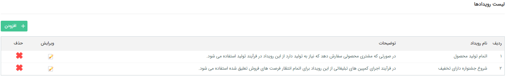

## لیست رویدادها

در این قسمت می توانید رویداد های مختلفی ایجاد کنید و در فعالیت های  [ فراخوانی رویداد](https://github.com/1stco/PayamGostarDocs/blob/master/help%202.5.4/Settings/Personalization-crm/Overview/Process-design/Create-a-work-cycle/Activity/Call-the-event/Call-the-event.md)و  [انتظار](https://github.com/1stco/PayamGostarDocs/blob/master/help%202.5.4/Settings/Personalization-crm/Overview/Process-design/Create-a-work-cycle/Activity/Waiting/Waiting.md) از آن ها استفاده کنید. برای اطلاعات بیشتر ابتدا توضیحات این فعالیت ها را مطالعه کنید.

در این بخش لیست رویدادهای تعریف شده را میتوان مشاهده کرد. برای تعریف یک رویداد جدید روی گزینه افزودن کلیک کنید و نام و توضیحات رویداد را وارد کنید.

